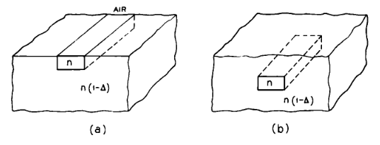
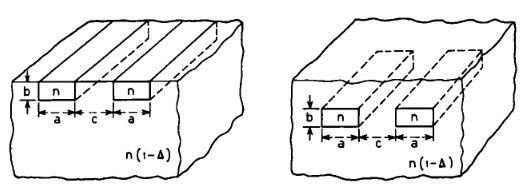

# I. Introdução

Propostas têm sido feitas para guias de onda dielétricos capazes de conduzir feixes em circuitos ópticos integrados de modo muito semelhante àquele em que guias de onda e cabos coaxiais são usados em circuitos de micro-ondas.[1–3] A Figura 1 mostra as geometrias básicas desses guias de onda. O guia é uma haste dielétrica de índice de refração $n$, imersa em outro dielétrico de índice de refração ligeiramente menor, $n(1-\Delta)$; ambos estão em contato com um terceiro dielétrico, que pode ser o ar (Fig. 1a) ou um dielétrico de índice de refração $n(1-\Delta)$ (Fig. 1b).

Figura 1 — Guias de onda dielétricos para circuitos ópticos integrados.

Essas geometrias são atraentes não apenas por sua simplicidade, precisão de construção e estabilidade mecânica, mas também porque, escolhendo $\Delta$ suficientemente pequeno, a operação em modo único pode ser obtida com dimensões transversais do guia grandes em comparação com o comprimento de onda no espaço livre, relaxando assim as exigências de tolerância de fabricação.

Embora, em um guia real, a seção transversal da haste guia não seja exatamente retangular e as fronteiras entre os dielétricos não sejam definidas abruptamente, como na Figura 1, vale a pena determinar as características dos modos nessa estrutura idealizada e os requisitos necessários para torná-la um guia de onda monomodo.

Além disso, acopladores direcionais obtidos pela aproximação de dois desses guias, como na Figura 2, podem tornar-se componentes importantes de circuito.[1,2] Neste artigo, estudamos a transmissão por meio de tal acoplador; os modos em um guia único aparecem como um caso particular, quando a separação entre os dois guias é suficientemente grande para que o acoplamento seja desprezível. Por meio do uso de uma técnica de perturbação, também determinamos as propriedades do acoplador quando os dois guias são ligeiramente diferentes.

Figura 2 — Acopladores direcionais.

As propriedades de guiamento do guia de seção transversal retangular imerso em um único dielétrico são comparadas com aquelas obtidas por cálculos computacionais de Goell.[4] De modo semelhante, as propriedades de acoplamento de dois guias de seção transversal quadrada imersos em um único dielétrico são comparadas com aquelas de dois guias de seção transversal circular obtidas por Jones e por Bracey e colaboradores.[5,6] Em ambas as comparações, a concordância é bastante boa.

---

## Observações

- O termo **dielectric waveguide** foi traduzido como **guia de onda dielétrico**.
- O termo **dielectric rod** foi mantido como **haste dielétrica**, por ser tecnicamente adequado ao contexto geométrico descrito por Marcatili.
- O parâmetro $\Delta$ aparece aqui como o contraste relativo entre índices de refração, sendo central para a possibilidade de operação monomodo.
- Nesta introdução, Marcatili já antecipa os dois grandes blocos do artigo:
  1. a análise do guia retangular dielétrico isolado;
  2. a análise do acoplador direcional formado por dois guias próximos.
- A introdução também deixa claro que a formulação adotada no artigo é **aproximada, porém analítica**, e que os resultados serão comparados com soluções computacionais disponíveis à época.

## Comentário técnico complementar

A motivação física principal é muito importante: ao escolher um contraste de índices pequeno, o confinamento continua ocorrendo, mas as dimensões transversais do guia podem ser maiores em relação ao comprimento de onda. Isso torna a fabricação menos crítica e ajuda a viabilizar estruturas para óptica integrada. Em outras palavras, Marcatili busca uma geometria simples, mecanicamente estável e com potencial de operação monomodo, sem exigir dimensões excessivamente pequenas.

Além disso, a introdução já mostra uma ideia que será essencial ao longo do artigo: o acoplador direcional pode ser tratado como uma extensão natural do problema do guia único. Quando os guias estão muito afastados, o acoplamento desaparece e recupera-se o caso isolado; quando estão próximos, surgem modos acoplados e transferência de potência entre eles.

<!-- NAV START -->
---

**Navegação:** [Anterior](00.6_revisao_camada_io.md) | [Índice](00_resumo.md) | [Checklist](09_checklist_reproducao.md) | [Roteiro](15_roteiro_de_estudo.md) | [Riscos](23_riscos_tecnicos_e_pendencias.md) | [Próximo](02_formulacao_do_problema_de_valor_de_contorno.md)

<!-- NAV END -->
