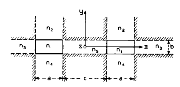

# II. Formulação do problema de valor de contorno

Para a análise, redesenhamos na Figura 3 a seção transversal do acoplador, subdividida em várias regiões. Nove dessas regiões possuem índices de refração $n_1$ a $n_5$; não especificamos os índices de refração nas seis regiões hachuradas. As razões para essas escolhas tornar-se-ão evidentes adiante.

Uma solução rigorosa desse problema de valor de contorno requer um computador.[4,7] Ainda assim, é possível introduzir uma simplificação drástica que permite obter uma solução em forma fechada. Essa simplificação surge da observação de que, para modos bem guiados, o campo decai exponencialmente nas regiões 2, 3, 4 e 5; portanto, a maior parte da potência se propaga na região 1, uma pequena parte se propaga nas regiões 2, 3, 4 e 5, e uma parcela ainda menor se propaga nas seis regiões hachuradas. Consequentemente, apenas um pequeno erro deve ser introduzido no cálculo dos campos na região 1 se não fizermos o casamento exato dos campos ao longo das bordas das regiões hachuradas.

O casamento imposto apenas ao longo dos quatro lados da região 1 pode ser obtido assumindo distribuições simples para os campos. Assim, as componentes de campo na região 1 variam senoidalmente nas direções $x$ e $y$; nas regiões 2 e 4, variam senoidalmente ao longo de $x$ e exponencialmente ao longo de $y$; e nas regiões 3 e 5, variam senoidalmente ao longo de $y$ e exponencialmente ao longo de $x$. As constantes de propagação $k_{x1}$, $k_{x2}$ e $k_{x4}$ ao longo de $x$, nos meios 1, 2 e 4, são idênticas e independentes de $y$. De modo semelhante, as constantes de propagação $k_{y1}$, $k_{y3}$ e $k_{y5}$ ao longo de $y$, nas regiões 1, 3 e 5, também são idênticas e independentes de $x$.

No apêndice, calculamos essas constantes de propagação e verificamos, como esperado, que todos os modos são híbridos e que o guiamento ocorre por reflexão interna total. Entretanto, por causa de outra aproximação, que consiste em escolher os índices de refração $n_2$, $n_3$, $n_4$ e $n_5$ ligeiramente menores que $n_1$, a reflexão interna total ocorre apenas quando as pequenas ondas planas que compõem um modo incidem sobre as interfaces em ângulos rasantes (Esta aproximação não é muito restritiva. Mesmo quando $n_1$ é 50% maior que $n_2$, $n_3$, $n_4$ e $n_5$, os resultados permanecem válidos). Consequentemente, as maiores componentes de campo são perpendiculares ao eixo de propagação; os modos são essencialmente do tipo TEM e podem ser agrupados em duas famílias, $E^y_{pq}$ e $E^x_{pq}$.

As principais componentes de campo dos modos da primeira família são $E_x$ e $H_y$, enquanto as da segunda família são $E_y$ e $H_x$. Os índices $p$ e $q$ indicam o número de extremos do campo elétrico ou magnético nas direções $x$ e $y$, respectivamente. Naturalmente, $E^y_{11}$ e $E^x_{11}$ são os modos fundamentais; concentraremo-nos neles ao discutir as propriedades de transmissão das diferentes estruturas.

---

## Observações editoriais

- O termo **boundary value problem** foi traduzido como **problema de valor de contorno**.
- O termo **matching** foi traduzido como **casamento** dos campos, que é a forma usual em textos técnicos quando se impõem condições de contorno entre regiões.
- O termo **well-guided modes** foi traduzido como **modos bem guiados**.
- O artigo deixa claro que a solução apresentada não é a solução rigorosa completa do problema, mas uma **aproximação analítica fortemente simplificada**.
- A notação das famílias modais foi mantida como $E^y_{pq}$ e $E^x_{pq}$, pois ela será importante nas seções seguintes.

## Comentário técnico complementar

Esta seção é central para entender toda a estratégia de Marcatili. Em vez de resolver exatamente o problema completo em todas as regiões da seção transversal, ele explora o fato físico de que, para modos bem confinados, a maior parte da energia permanece na região central do guia. Assim, as regiões periféricas menos importantes podem ser tratadas de forma aproximada, o que reduz drasticamente a complexidade do problema.

A ideia essencial é transformar um problema bidimensional rigoroso, com casamento completo de campos em todos os contornos, em um problema analítico tratável, no qual o casamento é imposto apenas nas interfaces mais relevantes da região central. Essa é a base que permitirá obter relações de dispersão aproximadas em forma fechada nas próximas seções.

Outro ponto importante é a interpretação modal. Embora os modos sejam rigorosamente híbridos, eles possuem uma polarização predominante, o que permite classificá-los em duas famílias. Essa classificação será fundamental para interpretar as curvas de dispersão, os modos fundamentais e o comportamento do acoplador direcional.

## Texto original correspondente

- início da Seção II: **Formulation of the Boundary Value Problem**;
- apresentação da Figura 3;
- justificativa física da aproximação;
- definição das duas famílias de modos fundamentais do problema.
