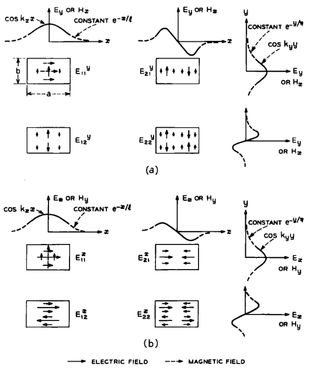

# 3.2 Os modos $E^{x}_{pq}$

Exceto pelo fato de que as principais componentes transversais são $E_x$ e $H_y$, os modos $E^{x}_{pq}$ são qualitativamente semelhantes aos modos $E^{y}_{pq}$ (Fig. 5b); eles diferem quantitativamente. Distinguindo, por meio de **negrito**, os símbolos correspondentes aos modos $E^{x}_{pq}$, a constante de propagação axial e as “profundidades de penetração” nos meios 2, 3, 4 e 5 são, de acordo com as equações (60), (63) e (64),

Figura 5 (b) — Guia imerso em diferentes dielétricos: distribuição de campo do modo fundamental (E^{y}_{11}).

## (17)

$$
\mathbf{k}_z = \left(k_1^2-\mathbf{k}_x^2-\mathbf{k}_y^2\right)^{1/2},
$$

## (18)

$$
\boldsymbol{\xi}_{3,5} = \frac{1}{\left|\mathbf{k}_{x\,3,5}\right|} = \left[ \left(\frac{\pi}{A_{3,5}}\right)^2-\mathbf{k}_x^2 \right]^{1/2},
$$

## (19)

$$
\boldsymbol{\eta}_{2,4} = \frac{1}{\left|\mathbf{k}_{y\,2,4}\right|} = \left[ \left(\frac{\pi}{A_{2,4}}\right)^2-\mathbf{k}_y^2 \right]^{1/2}.
$$

Nessas expressões, $\mathbf{k}_x$ e $\mathbf{k}_y$ são soluções das equações transcendentais

## (20)

$$
\mathbf{k}_x a = p\pi - \tan^{-1}\!\left(\frac{n_3^2}{n_1^2}\,\mathbf{k}_x\boldsymbol{\xi}_3\right) - \tan^{-1}\!\left(\frac{n_5^2}{n_1^2}\,\mathbf{k}_x\boldsymbol{\xi}_5\right),
$$

## (21)

$$
\mathbf{k}_y b = q\pi - \tan^{-1}\!\left(\mathbf{k}_y\boldsymbol{\eta}_2\right) - \tan^{-1}\!\left(\mathbf{k}_y\boldsymbol{\eta}_4\right).
$$

As soluções aproximadas, em forma fechada, dessas equações são

## (22)

$$
\mathbf{k}_x = \frac{p\pi}{a} \left( 1+\frac{n_3^2A_3+n_5^2A_5}{\pi n_1^2 a} \right)^{-1},
$$

e

## (23)

$$
\mathbf{k}_y = \frac{q\pi}{b} \left( 1+\frac{A_2+A_4}{\pi b} \right)^{-1}.
$$

Substituindo essas expressões nas equações (17), (18) e (19), obtemos os resultados explícitos:

## (24)

$$
\mathbf{k}_z = \left[ k_1^2 - \left(\frac{p\pi}{a}\right)^2 \left( 1+\frac{n_3^2A_3+n_5^2A_5}{\pi n_1^2 a} \right)^{-2} - \left(\frac{q\pi}{b}\right)^2 \left( 1+\frac{A_2+A_4}{\pi b} \right)^{-2} \right]^{1/2},
$$

## (25)

$$
\boldsymbol{\xi}_{3,5} = \frac{A_{3,5}}{\pi} \left[ 1- \left( \frac{pA_{3,5}}{a} \cdot \frac{1}{1 +  \frac{n_3^2A_3+n_5^2A_5}{\pi n_1^2 a}} \right)^2 \right]^{-1/2},
$$

## (26)

$$
\boldsymbol{\eta}_{2,4} = \frac{A_{2,4}}{\pi} \left[ 1- \left( \frac{qA_{2,4}}{b} \cdot \frac{1}{1+\frac{A_2+A_4}{\pi b}} \right)^2 \right]^{-1/2}.
$$

Se

$$
\frac{1}{n_1}\left(n_1-n_{2,3,4,5}\right)\ll 1,
$$

esses resultados coincidem com aqueles das equações (14), (15) e (16), indicando que os modos $E^{x}_{pq}$ e $E^{y}_{pq}$ tornam-se degenerados.

## Observações

- Nesta subseção, mantive a convenção do artigo: os símbolos em **negrito** distinguem as grandezas associadas à segunda família modal.
- O termo **penetration depth** foi novamente traduzido como **profundidade de penetração**.
- A conclusão sobre a degenerescência é muito importante fisicamente: quando o contraste entre $n_1$ e os meios vizinhos é pequeno, as duas famílias modais tornam-se praticamente equivalentes em termos de propagação.

## Comentário complementar

Esta subseção mostra que a segunda família de modos, embora tenha polarização predominante diferente, obedece a uma estrutura matemática muito parecida com a da subseção anterior. A diferença aparece na forma como os índices de refração entram nas equações transcendentais e, portanto, nas aproximações em forma fechada.

Do ponto de vista computacional, isso é excelente: o código do repositório poderá reutilizar quase toda a mesma lógica da família $E^{y}_{pq}$, mudando apenas as fórmulas específicas desta família. Em outras palavras, a implementação pode ser organizada de forma elegante, com um núcleo comum e duas variantes modais.

A observação final sobre a degenerescência também é central. Quando o contraste de índices é pequeno, os modos das duas famílias passam a ter constantes de propagação muito próximas. Isso ajuda a explicar por que, em várias geometrias do artigo, os modos fundamentais aparecem quase degenerados.
