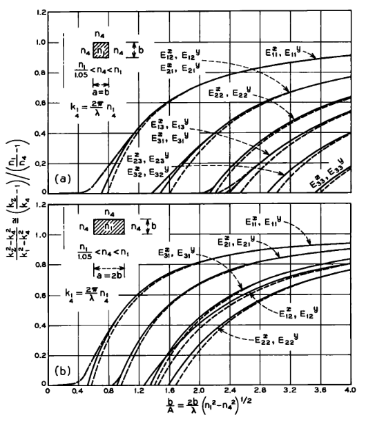
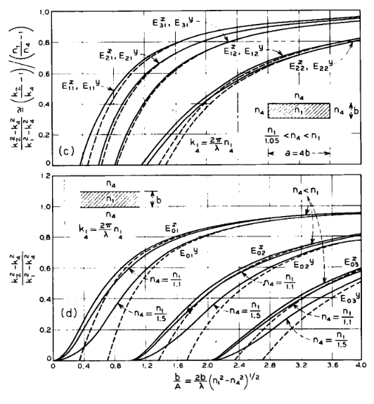
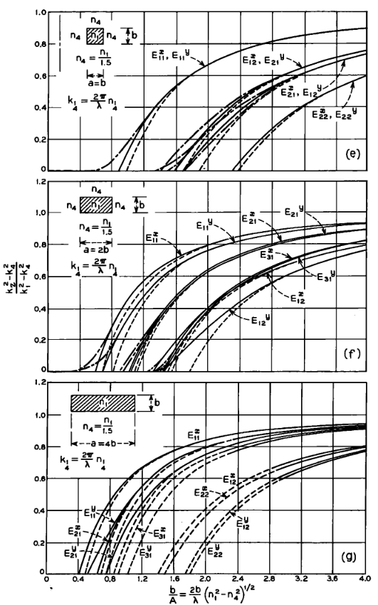
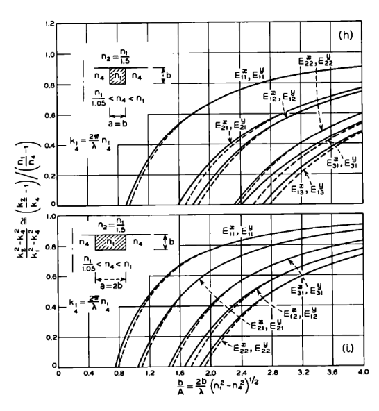
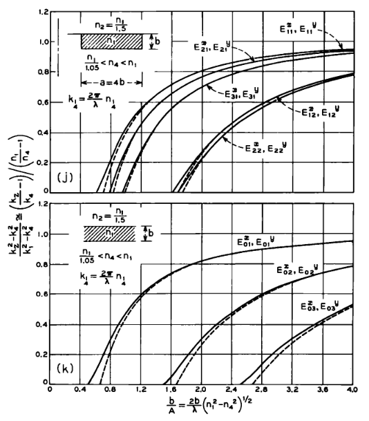
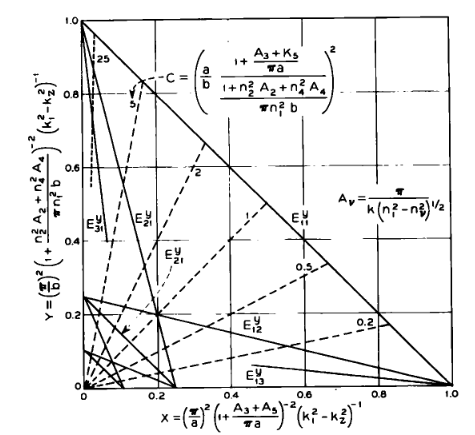
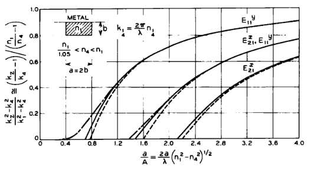

# 3.3 Exemplos

As constantes de propagação axial $k_z$ e $\mathbf{k}_z$, dadas nas equações (3) e (17) e devidamente normalizadas, foram representadas nas Figs. 6a até 6k como função da altura normalizada do guia,

$$
\frac{b}{A_4} = \frac{2b}{\lambda}\left(n_1^2-n_4^2\right)^{1/2},
$$

para várias geometrias e meios circundantes (Nessas figuras usamos o mesmo símbolo $k_z$ tanto para os modos $E^{y}_{pq}$ quanto para os modos $E^{x}_{pq}$).

A ordenada em cada uma dessas figuras é

$$
\frac{k_z^2-k_4^2}{k_1^2-k_4^2},
$$

e varia entre 0 e 1. Ela é igual a 0 quando $k_z=k_4$, isto é, quando o guia é tão pequeno que o modo em consideração deixa de ser guiado ou, em outras palavras, quando a “profundidade de penetração” no meio 4 é infinita. Ela é igual a 1 quando o guia é tão grande que $k_z=k_1$, o que significa que todo o campo se propaga no interior da haste guia e que as “profundidades de penetração” nos meios 2, 3, 4 e 5 são nulas.

As curvas contínuas foram obtidas usando as soluções numéricas exatas das equações transcendentais (6), (7), (20) e (21) para as constantes de propagação transversais $k_x$, $k_y$; as linhas tracejadas foram obtidas usando as aproximações em forma fechada (12), (13), (22) e (23). Nas Figs. 6a, 6b, 6e e 6f, para comparação, também foram incluídas as linhas traço-ponto, que são os resultados obtidos por Goell como soluções computacionais do problema de valor de contorno.

As três soluções coincidem mesmo para valores moderadamente grandes de $b$. Assim, para um guia e um modo tais que

$$
\frac{k_z^2-k_4^2}{k_1^2-k_4^2}\ge 0.5,
$$

a aproximação em forma fechada difere do valor exato em apenas alguns poucos por cento. Isso nos dá confiança para usar esses resultados em guias com razão de aspecto $a/b>2$, em guias circundados por vários dielétricos e em acopladores direcionais para os quais não existem cálculos computacionais disponíveis.

A maior discrepância entre nossos resultados e os de Goell ocorre para

$$
\frac{k_z^2-k_4^2}{k_1^2-k_4^2}\cong 0,
$$

e especialmente para os modos fundamentais $E^{x}_{11}$ e $E^{y}_{11}$. Nossa teoria aproximada é incapaz de prever o fato de que esses modos permanecem guiados independentemente de quão pequena seja a seção transversal do guia.

As Figs. 6a até 6d cobrem os casos de guias retangulares totalmente embebidos em um único dielétrico de índice de refração ligeiramente menor. Para todos os propósitos práticos, dado $p$ e $q$, os modos $E^{x}_{pq}$ e $E^{y}_{pq}$ são degenerados, e a seção transversal quadrada fornece a maior separação entre modos.

Figura 6  — Constante de propagação para diferentes modos e guias. — soluções das equações transcendentais; — — soluções em forma fechada; — · — · — soluções computacionais de Goell para o problema de valor de contorno.

As Figs. 6e até 6g também consideram guias retangulares embebidos em um único dielétrico, mas o índice de refração externo é 1,5 vezes menor que o interno. Uma haste de vidro imersa em ar é um exemplo. A diferença substancial entre os índices de refração quebra a degenerescência para qualquer seção transversal retangular. Guias retangulares como os da Fig. 1a, com três lados em contato com dielétricos de índice de refração ligeiramente menor e o quarto lado em contato com ar, são tratados nas Figs. 6h até 6k.

Figura 6  — Constante de propagação para diferentes modos e guias. — soluções das equações transcendentais; — — soluções em forma fechada; — · — · — soluções computacionais de Goell para o problema de valor de contorno.

A relação de dispersão aproximada (14) para os modos $E^{x}_{pq}$, em um guia retangular circundado por quatro dielétricos diferentes, foi colocada em forma gráfica na Fig. 7, traçando-se a equação equivalente

## (27)

$$
p^2X+q^2Y=1,
$$

na qual

## (28)

$$
X = \left(\frac{\pi}{a}\right)^2 \left(1+\frac{A_3+A_5}{\pi a}\right)^{-2} \left(k_1^2-k_z^2\right)^{-1},
$$

e

## (29)

$$
Y = \left(\frac{\pi}{b}\right)^2 \left(1+\frac{n_2^2A_2+n_4^2A_4}{\pi n_1^2 b}\right)^{-2} \left(k_1^2-k_z^2\right)^{-1}.
$$

Figura 7  — Nomograma para dimensionar um guia imerso em vários dielétricos de modo que ele suporte qualquer número prescrito de modos.

As curvas traçadas para diferentes valores de $p$ e $q$ são linhas retas (linhas contínuas); como os valores de $X$ e $Y$ só têm significado físico quando são positivos, os gráficos ficam restritos ao primeiro quadrante. Na Fig. 7, as linhas pontilhadas representam a equação

## (30)

$$
\frac{Y}{X} = \left[ \frac{a}{b} \, \frac{1+\frac{A_3+A_5}{\pi a}} {1+\frac{n_2^2A_2+n_4^2A_4}{\pi n_1^2 b}} \right]^2 = C.
$$

Dado qualquer guia, podemos calcular $C$, que é função das dimensões, dos índices de refração e do comprimento de onda. A linha pontilhada correspondente intercepta todas as linhas contínuas que representam os diferentes modos. A abcissa ou a ordenada de cada interseção fornece, após alguma álgebra, a constante de propagação $k_z$ de cada modo particular. Se o valor obtido para $k_z$ for menor que o menor valor de $k_v$, esse modo não é guiado.

Outra forma de usar o gráfico é a seguinte: suponha que se queira um guia com dimensões tais que, para um dado comprimento de onda, apenas o modo $E^{y}_{11}$ seja suportado. Tomando $k_z=k_{z,\min}$, qualquer combinação de $n_1$, $n_2$, $n_3$, $n_4$, $n_5$, $a$ e $b$, representada por um ponto dentro do triângulo limitado pelas linhas contínuas $E^{y}_{11}$, $E^{y}_{12}$ e $E^{y}_{21}$, satisfará a exigência proposta de operação monomodo.

No gráfico, basta substituir $a$ por $b$, e tudo o que foi dito sobre os modos $E^{y}_{pq}$ torna-se aplicável aos modos $E^{x}_{pq}$.

As Figs. 6a até 6k foram usadas para determinar dimensões de vários guias. Todos eles possuem as maiores dimensões compatíveis com o guiamento exclusivo dos modos $E^{x}_{11}$ e $E^{y}_{11}$. Os resultados estão reunidos na Tabela I.

## Tabela I — Dimensões típicas para vários guias\*

### Caso 1 — guia totalmente embebido em um único dielétrico\†

| Geometria | $n_1/n_4 = 1.001$ | $n_1/n_4 = 1.01$ | $n_1/n_4 = 1.05$ | $n_1/n_4 = 1.5$ |
| --- | ---: | ---: | ---: | ---: |
| $a=b$ | 15.30 | 4.90 | 2.25 | 0.92 |
| $a=2b$ | 19.00 | 6.10 | 2.80 | 1.21 |
| $a=4b$ | 26.80 | 8.50 | 3.80 | 1.37 |

### Caso 2 — guia assimétrico, com $n_1/n_2 = 1.5$\†

| Geometria | $n_1/n_4 = 1.001$ | $n_1/n_4 = 1.01$ | $n_1/n_4 = 1.05$ |
| --- | ---: | ---: | ---: |
| $a=b$ | 17.70 | 5.60 | 2.60 |
| $a=2b$ | 23.20 | 7.40 | 3.40 |
| $a=4b$ | 34.90 | 11.00 | 4.90 |

### Notas da tabela

\* As dimensões referem-se a guias capazes de suportar apenas os modos fundamentais $E^{x}_{11}$ e $E^{y}_{11}$.  
\† Todos os números da tabela devem ser multiplicados por $\lambda/n_1$.

Em geral, a geometria com $n_2<n_4$ exige uma seção transversal de guia de onda maior do que aquela com $n_2=n_4$. Isso significa que reduzir o índice de refração em um dos lados do guia diminui sua capacidade de guiar. A explicação desse aparente paradoxo está no fato conhecido de que uma lâmina simétrica realmente guia “melhor” do que uma assimétrica. Comparando, por exemplo, as Figs. 6d e 6k, nas quais as curvas contínuas foram traçadas resolvendo-se exatamente as equações de Maxwell, os modos $E^{x}_{p1}$ e $E^{y}_{p1}$ podem ser guiados pela lâmina simétrica (Fig. 6d) independentemente de quão pequena seja a espessura $b$; já para a lâmina assimétrica (Fig. 6k), existe uma espessura mínima necessária para guiar esses mesmos modos.[8]

Considere o guia imerso em um único dielétrico. Em geral, a altura $b$ do guia é inversamente proporcional a

$$
\frac{1}{\left(n_1^2-n_4^2\right)^{1/2}}.
$$

Para $n_1=1.5$, $n_4=1$ e $\lambda=1\,\mu\text{m}$, a maior altura de guia corresponde à seção transversal quadrada, e $b=a=0.61\,\mu\text{m}$. Essa dimensão pode ser pequena demais e difícil de controlar. As exigências de tolerância podem ser relaxadas escolhendo-se $n_1-n_4\ll 1$. Entretanto, essa diferença não pode ser arbitrariamente pequena, porque o guia perde sua capacidade de contornar curvas acentuadas.[11]

Em todos esses exemplos, os modos fundamentais $E^{x}_{11}$ e $E^{y}_{11}$ são quase degenerados, de modo que imperfeições de simetria do guia tendem a acoplar esses modos. Uma camada com perdas, adicionada a uma das interfaces entre a haste guia e os dielétricos circundantes, deve atenuar o modo cuja polarização é paralela a essa interface. Como alternativa, o guia pode ser projetado para suportar apenas o modo fundamental $E^{y}_{11}$, substituindo-se o meio 2 por um meio de baixa impedância, como um dielétrico de alto índice de refração ou um metal.

Um exemplo desse tipo de guia e a constante de propagação de seus modos são mostrados na Fig. 8. Escolhendo-se

$$
a<
\frac{0.7\lambda}{\left(n_1^2-n_4^2\right)^{1/2}},
$$

apenas o modo $E^{y}_{11}$ é guiado. Se o metal não for perfeito, há fuga de potência para o meio de baixa impedância. Quanto menor essa impedância, menor a fuga.

Figura 8  — Constante de propagação para modos em um guia circundado por metal e dielétricos — soluções das equações transcendentais; — — soluções em forma fechada; — · — · — soluções computacionais de Goell para o problema de valor de contorno.

Guias para óptica integrada podem ser mais fáceis de construir com $a/b\gg 1$. Podemos usar a Fig. 7 para projetar um guia de dimensões arbitrárias $a$ e $b$, ainda capaz de suportar apenas os modos $E^{x}_{11}$ e $E^{y}_{11}$. Como exemplo, calculemos quais devem ser os valores de

$$
n_3=n_5=n_1(1-\Delta)
\quad\text{e}\quad
n_2=n_4=n_1(1-\Delta'),
$$

assumindo

$$
\Delta,\Delta' \ll 1,
\qquad
\frac{a}{b}=5.
$$

Escolhendo

## (31)

$$
\left(\frac{\Delta'}{\Delta}\right)^{1/2} = \frac{a}{b} = 5,
$$

obtém-se, a partir da Fig. 7,

$$
C=\left(\frac{a}{b}\right)^2=25.
$$

A curva correspondente a $C=25$ foi traçada como uma linha pontilhada na Fig. 7. Ela intercepta a linha $E^{x}_{21}$ em

$$
Y = \left[ \frac{b}{\pi} + \frac{1}{\pi n_1} \left(\frac{2}{\Delta'}\right)^{1/2}  \right]^{-2}
\left(k_1^2-k_z^2\right)^{-1} = 0.88.
$$

**TODO OCR:** o scan da figura mostra a reta rotulada como $E^{y}_{21}$, enquanto a frase acima menciona $E^{x}_{21}$. No repositório, a checagem numérica do nomograma usa a reta plotada de indices $(p,q)=(2,1)$ e registra essa ambiguidade explicitamente.

**Observacao numerica:** a leitura $Y=0.88$ parece ser grafica. Para a reta do nomograma com $(p,q)=(2,1)$ e para a linha $C=25$, a interseccao geometrica exata de

$$
p^2 X + q^2 Y = 1
\quad\text{e}\quad
Y = C X
$$

leva a

$$
Y = \frac{25}{4+25} = \frac{25}{29} \approx 0.8621.
$$

Esse valor exato fica proximo do `0.88` lido do grafico impresso e e a referencia usada pelo caso `reproduce_fig7`.

Nessa expressão, impondo-se

$$
k_z=kn_1(1-\Delta),
$$

o guia suporta apenas os modos $E^{y}_{11}$ e $E^{x}_{11}$; sua altura é então

## (32)

$$
b = 1.66\, \frac{\lambda}{n_1(\Delta')^{1/2}}.
$$

Podemos escolher $b$ arbitrariamente por meio da seleção apropriada de $\Delta'$. Para

$$
\lambda=1\,\mu\text{m},
\qquad
n_1=1.5,
\qquad
b=5\,\mu\text{m},
$$

das equações (31) e (32) obtemos

$$
a=25\,\mu\text{m},
\qquad
\Delta=0.002,
\qquad
\Delta'=0.05.
$$

---

## Observações

- Nesta subseção, Marcatili compara três níveis de descrição:
  1. solução numérica exata das equações transcendentais;
  2. aproximação em forma fechada;
  3. resultados computacionais de Goell.
- A conclusão prática é bastante importante: quando a quantidade normalizada
  $$
  \frac{k_z^2-k_4^2}{k_1^2-k_4^2}
  $$
  é suficientemente grande, a aproximação analítica torna-se muito confiável.
- O nomograma da Fig. 7 é uma ferramenta de projeto: ele permite escolher dimensões e índices de refração para controlar quantos modos serão guiados.
- Na parte final da subseção, o artigo mostra como usar esse nomograma para projetar um guia monomodo com razão de aspecto elevada.

## Comentário complementar

Esta subseção é o elo entre a formulação teórica e o uso prático das equações. Ela mostra, com dados e curvas, quando a aproximação de Marcatili é confiável e como ela pode ser usada para projeto de guias reais.

O ponto mais forte aqui é que o artigo não fica apenas na derivação formal: ele traduz as expressões para curvas de dispersão, nomogramas e tabelas de dimensionamento. Isso é excelente para o repositório, porque dá metas muito claras de reprodução:

- recriar as curvas das Figs. 6a–6k;
- implementar o nomograma da Fig. 7;
- reproduzir a Tabela I;
- verificar o exemplo final que leva a $a=25\,\mu\text{m}$, $\Delta=0.002$ e $\Delta'=0.05$.

Também fica claro que o comportamento degenerado entre $E^{x}_{11}$ e $E^{y}_{11}$ depende fortemente do contraste de índices. Quando o contraste é pequeno, os modos ficam muito próximos; quando o contraste aumenta ou a estrutura se torna assimétrica, essa degenerescência é quebrada.
