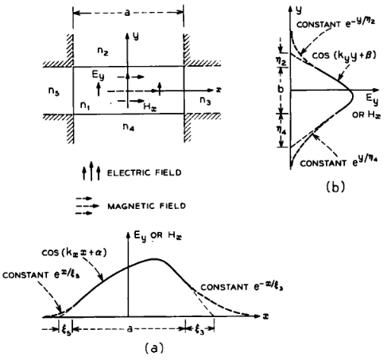

# III. Guia imerso em vários dielétricos

O guia imerso em vários dielétricos (Fig. 4a) é obtido a partir da Fig. 3 escolhendo-se

## (1)

$$
c=\infty .
$$

Ele suporta um número discreto de modos guiados, que agrupamos em duas famílias, $E^x_{pq}$ e $E^y_{pq}$, além de um contínuo de modos não guiados.

Figura 4 — Guia imerso em diferentes dielétricos: (a) seção transversal e (b) distribuição de campo do modo fundamental (E^{y}_{11}).
