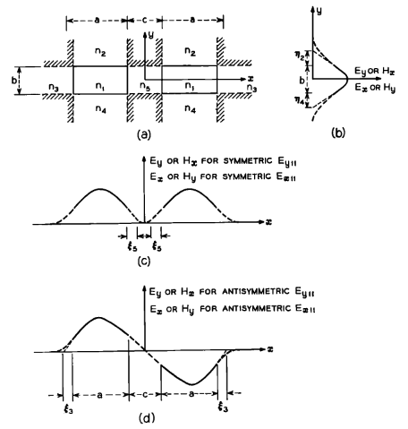
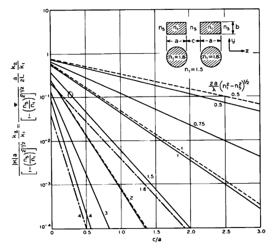
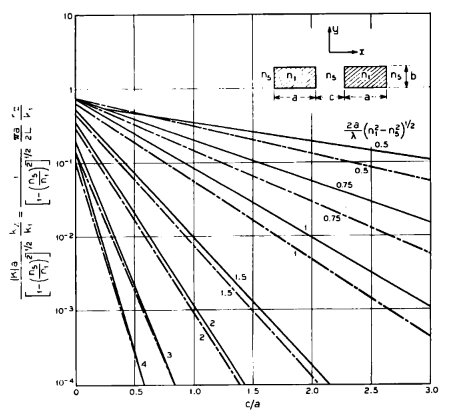

# IV. Acoplador direcional

Em geral, o acoplador direcional pode transmitir modos $E^{x}_{pq}$ e $E^{y}_{pq}$; porém, se os lados $a$ e $b$ dos guias forem escolhidos suficientemente pequenos, apenas os modos fundamentais $E^{x}_{11}$ e $E^{y}_{11}$ serão guiados. Concentremo-nos no modo $E^{x}_{11}$. O acoplador guia dois tipos de modos $E^{x}_{11}$: um deles é simétrico (Fig. 9c), enquanto o outro é antissimétrico (Fig. 9d). Ambos são essencialmente modos do tipo TEM, com principais componentes de campo $E_x$ e $H_y$. Os perfis de intensidade dos campos elétrico e magnético para ambos os modos são mostrados qualitativamente nas Figs. 9b, 9c e 9d.

Figura 9  — Acoplador direcional imerso em vários dielétricos: (a) seção transversal; (b), (c) e (d) distribuições de campo.

Desprezando os pequenos efeitos introduzidos pelo acoplamento fraco, a largura elétrica $k_x a$ e a altura elétrica $k_y b$ de cada guia, bem como as profundidades de penetração $\xi_5$ e $\eta_4$, coincidem com aquelas do guia descrito na Seção III. Raciocínio semelhante aplica-se ao modo $E^{y}_{11}$.

O coeficiente de acoplamento $K$ entre os dois guias e o comprimento $L$ necessário para a transferência completa de potência de um guia para o outro são, de acordo com as equações (56) e (59),

## (33)

$$
-iK=\frac{\pi}{2L} = 2\,\frac{k_x^2}{k_z}\, \frac{\xi_5}{a} \frac{\exp(-c/\xi_5)}{1+k_x^2\xi_5^2}.
$$

Para modos $E^{y}_{pq}$, $k_x$, $k_z$ e $\xi_5$ são dados nas equações (3) e (8), e $k_x$ é a solução da equação (6). De modo semelhante, para modos $E^{x}_{pq}$, $\mathbf{k}_x$, $\mathbf{k}_z$ e $\boldsymbol{\xi}_5$ são obtidos das equações (17), (18) e (20). Como esperado, o acoplamento decresce exponencialmente com a razão $c/\xi_5$, entre a separação dos guias e a penetração de campo no meio 5.

O coeficiente de acoplamento normalizado

## (34)

$$
\frac{|K|\,a} {\left[1-\left(\frac{n_5}{n_1}\right)^2\right]^{1/2}k_z} = \frac{\pi a} {2L\left[1-\left(\frac{n_5}{n_1}\right)^2\right]^{1/2}k_z} = 2\left(\frac{k_xA_5}{\pi}\right)^2 \left[ 1-\left(\frac{k_xA_5}{\pi}\right)^2 \right]^{1/2} \exp\left\{ -\pi\frac{c}{A_5} \left[ 1-\left(\frac{k_xA_5}{\pi}\right)^2 \right]^{1/2} \right\}.
$$

A equação de acoplamento normalizado acima é obtida a partir da equação (33), substituindo-se $\xi_5$ por seu valor dado na equação (8). Ela foi representada na Fig. 10 para o modo $E^{x}_{11}$, assumindo $n_3=n_5$ e $n_1/n_5$ arbitrário. As linhas contínuas e pontilhadas foram obtidas usando, respectivamente, a solução exata da equação (6) e a expressão aproximada (12) para $k_x$. Ambos os conjuntos de curvas são muito próximos entre si, especialmente para

$$
\frac{2a}{\lambda}\left(n_1^2-n_5^2\right)^{1/2}\ge 1.
$$

**Observacao de reproducao do repositorio:** a implementacao atual da Fig. 10 segue exatamente essa referencia textual, isto e, usa Eq. (34) combinada com Eq. (6) no caso exato e Eq. (12) no caso aproximado. O texto e a notacao modal ainda merecem revisao de OCR, porque a figura e descrita como pertencente ao modo $E^{x}_{11}$, enquanto as equacoes citadas nessa frase pertencem a familia tratada na Secao III como $E^y$.

**Estado atual da API:** `solve_coupler` continua reportando a forma normalizada de Eq. (34) como saida central, mas agora tambem pode reconstruir $A_5$, $a$, $c$, $|K|$ e $L$ quando `wavelength`, `n1` e `n5` sao fornecidos no caso de entrada. Essa dimensionalizacao segue o mesmo modelo reduzido usado nas Figs. 10 e 11.

Figura 10  — Coeficiente de acoplamento para modos $E^{x}_{1q}$. — acoplamento calculado a partir das equações transcendentais; — — aproximações em forma fechada; — · — · — acoplamento entre duas hastes cilíndricas (A. L. Jones).

As linhas traço-ponto são os acoplamentos obtidos por A. L. Jones para dois cilindros paralelos de índice de refração $n_1=1.8$, imersos em um meio com $n_5=1.5$. Como esperado, se os diâmetros dos guias circulares forem iguais às larguras dos guias retangulares, e se as separações forem as mesmas, o acoplamento entre os guias circulares deve ser ligeiramente menor do que aquele entre os guias retangulares.

A equação de acoplamento normalizado (34) para o modo $E^{y}_{11}$ foi representada na Fig. 11, usando para $\mathbf{k}_x$ a solução exata da equação (20). Para $n_1/n_5$ próximo da unidade, as curvas aproximam-se das curvas contínuas da Fig. 10, à medida que os modos $E^{x}_{11}$ e $E^{y}_{11}$ se aproximam da degenerescência. A influência da altura $b$ dos guias, dos índices de refração $n_2$ e $n_4$, e do valor de $q$ no acoplamento de qualquer um dos modos não é importante, pois esses parâmetros afetam apenas $k_z$.

**Observacao de reproducao do repositorio:** a implementacao atual da Fig. 11 segue exatamente essa frase, isto e, usa Eq. (34) combinada com a raiz exata da Eq. (20). O caso-base mantem as duas familias de legenda do scan, com linhas continuas para $n_1/n_5=1.5$ e linhas traco-ponto para $n_1/n_5=1.1$, e rotula cada curva pelo parametro $a/A_5 = \frac{2a}{\lambda}\left(n_1^2-n_5^2\right)^{1/2}$.

Figura 11  — Coeficiente de acoplamento para modos $E^{y}_{1q}$. — acoplamento para $n_1/n_5 = 1.5$; — · — · — acoplamento para $n_1/n_5 = 1.1$.

Para trabalhar alguns exemplos, assumamos

$$
n_1=1.5,
\qquad
n_2=n_3=n_4=n_5=\frac{1.5}{1.01},
\qquad
a=2b.
$$

Para garantir que cada guia suporte apenas os modos $E^{x}_{11}$ e $E^{y}_{11}$, a dimensão normalizada $b$, de acordo com a Fig. 6b, deve ser escolhida de modo que

$$
\frac{2b}{\lambda}\left(n_1^2-n_4^2\right)^{1/2}=0.75.
$$

Consequentemente,

$$
b=1.77\lambda,
\qquad
a=3.54\lambda,
\qquad
\frac{k_z}{k_1}\cong 1.
$$

Da Fig. 10 obtemos o comprimento de acoplador $L$ para transferência completa de potência:

$$
L=6540\lambda
\quad \text{para} \quad c=a,
\qquad\text{e}\qquad
L=262\lambda
\quad \text{para} \quad c=\frac{a}{4}.
$$

Quão distantes devem estar dois guias de comprimento $l$ para que o acoplamento seja pequeno? Se o coeficiente de transferência $|T|=l|K|\ll 1$, da equação (33) obtemos

## (35)

$$
c = \xi_5 \log\left[ 2\frac{l}{|T|} \frac{k_x^2}{k_z} \frac{\xi_5}{a} \frac{1}{1+k_x^2\xi_5^2} \right].
$$

Para as mesmas dimensões de guia do exemplo anterior, e para

$$
l=1\text{ cm},
\qquad
\lambda=1\,\mu\text{m},
\qquad
T=0.01,
$$

obtemos, da equação (35) ou da Fig. 10, que $c/a=2.5$. Consequentemente, ambos os guias, com largura $3.54\,\mu\text{m}$ e comprimento de 1 cm, apresentariam acoplamento de $-40\,\text{dB}$ se sua separação fosse $8.9\,\mu\text{m}$.

Agora avaliamos como uma pequena mudança no índice de refração entre os guias modifica seu acoplamento. Esse seria o caso se o meio entre os guias fosse, por exemplo, um material eletro-óptico e alterássemos o campo aplicado para modular ou comutar a saída.

Para os modos $E^{x}_{11}$ e $E^{y}_{11}$, assumindo modos bem guiados $(k_xA_5/\pi\ll 1)$ e $(n_1-n_5)/n_1\ll 1$, a razão entre os acoplamentos para dois valores do índice de refração no meio 5 (por exemplo, $n_5$ e $n_5(1+\delta)$) resulta das equações (34) e (12):

## (36)

$$
\frac{K_1}{K_2} = \frac{L_2}{L_1} = \exp\left\{ -\pi \left(\frac{n_1^2}{n_5^2}-1\right)^{-1} \frac{c\delta}{A_5} \left[ 1-\left(\frac{2}{\pi}+\frac{a}{A_5}\right)^{-2} \right]^{1/2} \right\}.
$$

Essa razão é igual a $1/2$ se

## (37)

$$
\delta = 0.22 \left(\frac{n_1^2}{n_5^2}-1\right) \frac{A_5}{c} \left[ 1-\left(\frac{2}{\pi}+\frac{a}{A_5}\right)^{-2} \right]^{-1/2}.
$$

Um acoplador direcional com coeficiente de acoplamento $K_1$ e comprimento $L=\pi/|2K_1|$ transferiria toda a potência de um guia para o outro. Se o índice de refração do meio entre os guias fosse alterado de $n_5$ para $n_5(1+\delta)$, de modo que a equação (37) fosse satisfeita, a potência emergiria pela extremidade do guia de entrada. Quanto maior a separação $c$ entre os guias, e quanto menor a diferença entre os índices de refração $n_1-n_5$, menor será a variação de índice de refração requerida.

Seguindo o exemplo acima, para

$$
n_1=1.5,
\qquad
n_2=n_3=n_4=n_5=\frac{1.5}{1.01},
$$

$$
a=1.5A_5=3.54\lambda,
\qquad
c=a,
$$

a variação percentual de índice requerida é apenas

$$
\delta=0.0033.
$$

## Observações editoriais

- O termo **loose coupling** foi traduzido como **acoplamento fraco**.
- O termo **complete transfer of power** foi traduzido como **transferência completa de potência**.
- As equações (33) a (37) são fundamentais para a futura implementação do módulo do acoplador no repositório.

## Comentário complementar

Esta seção mostra que o problema do acoplador direcional pode ser tratado como uma extensão natural do problema do guia único. Quando os guias estão afastados, o acoplamento é pequeno; quando são aproximados, surgem dois supermodos, um simétrico e outro antissimétrico, e a diferença entre suas constantes de propagação produz a transferência periódica de potência entre os guias.

Do ponto de vista computacional, esta é uma seção excelente para reprodução, porque ela fornece:

- uma fórmula explícita para o coeficiente de acoplamento;
- curvas normalizadas para comparação;
- exemplos numéricos concretos;
- uma expressão para estimar a separação necessária entre os guias para limitar o acoplamento;
- uma análise de sensibilidade do acoplamento em relação ao índice de refração do meio intermediário.

A parte final é particularmente interessante para aplicações em modulação e chaveamento óptico, pois mostra que pequenas variações do índice de refração entre os guias podem alterar significativamente a transferência de potência.

<!-- NAV START -->
---

**Navegação:** [Anterior](03.3_exemplos.md) | [Índice](00_resumo.md) | [Checklist](09_checklist_reproducao.md) | [Roteiro](15_roteiro_de_estudo.md) | [Riscos](23_riscos_tecnicos_e_pendencias.md) | [Próximo](05_Acoplador direcional construído com guias ligeiramente diferentes.md)

<!-- NAV END -->
