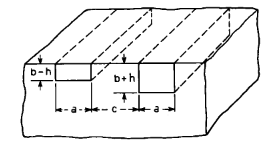
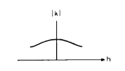

# V. Acoplador direcional construído com guias ligeiramente diferentes

Considere o acoplador direcional da Fig. 12, no qual os dois guias possuem alturas ligeiramente diferentes: um mede $b+h$ e o outro $b-h$.

Figura 12 — Acoplador direcional com guias de alturas diferentes.

Façamos um esboço qualitativo do coeficiente de acoplamento como função de $h$, conforme a Fig. 13. Por argumentos simples de simetria, o valor absoluto do coeficiente de acoplamento é estacionário (isto é, sua primeira derivada é nula) em torno de $h=0$. Portanto, o coeficiente de acoplamento entre dois guias de alturas $b_1$ e $b_2$ é o mesmo que aquele entre dois guias idênticos de altura $\tfrac{1}{2}(b_1+b_2)$, desde que $|b_1-b_2|$ seja suficientemente pequeno.

Figura 13  — Comportamento qualitativo do coeficiente de acoplamento em função de (h).

Esse raciocínio aplica-se a guias com larguras, alturas e índices de refração diferentes, desde que as diferenças sejam suficientemente pequenas. Infelizmente, como ocorre na maior parte das análises perturbativas, não sabemos exatamente o que significa “suficientemente pequeno” a menos que calculemos o termo de ordem superior seguinte.

---

## Observações

- O termo **stationary** foi traduzido como **estacionário**, no sentido matemático de derivada primeira nula.
- A ideia central é que pequenas assimetrias entre os guias não alteram o acoplamento na primeira ordem, desde que a diferença entre eles permaneça pequena.

## Comentário complementar

Esta seção introduz uma observação importante para projeto: pequenas diferenças geométricas entre dois guias acoplados não afetam imediatamente o coeficiente de acoplamento na primeira ordem. Em outras palavras, perto da configuração simétrica, o acoplamento varia de forma suave, e o caso assimétrico pode ser aproximado pelo caso simétrico correspondente à média geométrica das dimensões.

Do ponto de vista numérico e experimental, isso é bastante útil. Significa que pequenas imperfeições de fabricação ou pequenas variações dimensionais podem, até certo ponto, ser tratadas como perturbações moderadas do caso ideal simétrico. No entanto, o próprio autor alerta para a limitação dessa conclusão: sem calcular termos de ordem superior, não se pode definir rigorosamente o intervalo de validade da aproximação.
