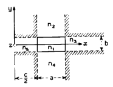
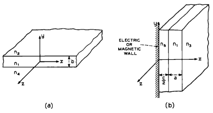

# APÊNDICE A

## Análise de campos do acoplador direcional

Resolvemos as equações de Maxwell para o acoplador direcional cuja seção transversal está representada na Fig. 3. A estrutura é simétrica em relação ao plano $x=0$; portanto, os modos possuem campos elétricos que são simétricos ou antissimétricos em relação a esse plano. Consequentemente, o guia que devemos estudar é mais simples (Fig. 14): se o plano $x=0$ for um curto-circuito elétrico, os modos do acoplador que se propagam ao longo de $z$ são antissimétricos; se o plano $x=0$ for um curto-circuito magnético, os modos são simétricos. Como é bem conhecido, é a interação desses modos simétricos e antissimétricos, viajando com velocidades de fase diferentes ao longo de $z$, que representa o efeito de acoplamento.

Como discutido na Seção II, ao desprezar a potência que se propaga através das regiões hachuradas, os campos precisam ser ajustados apenas ao longo dos lados da região 1. Verificamos que duas famílias de modos podem satisfazer as condições de contorno; nós as denominamos $E^{x}_{pq}$ e $E^{y}_{pq}$. Cada modo da primeira família tem a maior parte de seu campo elétrico polarizada na direção $x$, enquanto cada modo da segunda família tem o campo elétrico quase completamente polarizado na direção $y$. Os índices $p$ e $q$ caracterizam o membro da família pelo número de extremos que essas componentes transversais de campo apresentam ao longo das direções $x$ e $y$, respectivamente. Por exemplo, o modo $E^{x}_{11}$ tem seu campo elétrico virtualmente ao longo de $x$, seu campo magnético ao longo de $y$; as amplitudes do campo possuem um máximo em cada direção.

Cada família de modos será estudada separadamente.

Figura 14  — Seção transversal do acoplador com o plano (x = 0) sendo um curto-circuito elétrico ou magnético.

## A.1 Modos $E^{y}_{pq}$: polarização ao longo de $y$

As componentes de campo na $v$-ésima das cinco regiões da Fig. 14 são:[13]

$$
H_x = e^{-ik_z z+i\omega t} \begin{cases} M_1 \cos(k_x x+\alpha)\cos(k_y y+\beta), & \nu=1,\$$4pt M_2 \cos(k_x x+\alpha)\exp(-ik_{y2}y), & \nu=2,\$$4pt M_3 \cos(k_y y+\beta)\exp(-ik_{x3}x), & \nu=3,\$$4pt M_4 \cos(k_x x+\alpha)\exp(ik_{y4}y), & \nu=4,\$$4pt M_5 \cos(k_y y+\beta)\sin(k_{x5}x+\gamma), & \nu=5, \end{cases}
$$

$$
H_y=0,
$$

$$
H_z
=
-\frac{i}{k_z}\,
\frac{\partial^2 H_x}{\partial x\,\partial y},
\tag{38}
$$

$$
E_x
=
-\frac{1}{\omega\varepsilon n_\nu^2 k_z}
\frac{\partial^2 H_x}{\partial x\,\partial y},
$$

$$
E_y
=
\frac{k^2 n_\nu^2-k_y^2}{\omega\varepsilon n_\nu^2 k_z}\,H_x,
$$

$$
E_z
=
\frac{i}{\omega\varepsilon n_\nu^2}
\frac{\partial H_x}{\partial y}.
$$

Nessas expressões, $M_\nu$ determina a amplitude do campo no $\nu$-ésimo meio; $\alpha$ e $\beta$ localizam os máximos e mínimos do campo na região 1; $\gamma$, igual a $0^\circ$ ou $90^\circ$, implica que o plano $x=0$ é um curto-circuito elétrico (modo antissimétrico) ou magnético (modo simétrico), respectivamente; $\omega$ é a frequência angular; e $\mu$ (aparecendo em $k^2=\omega^2\varepsilon\mu$) é a permissividade e a permeabilidade do espaço livre.

No $\nu$-ésimo meio, o índice de refração é $n_\nu$, e as constantes de propagação $k_{x\nu}$, $k_{y\nu}$ e $k_z$ estão relacionadas por

$$
k_{x\nu}^2+k_{y\nu}^2+k_z^2
=
\omega^2\varepsilon\mu\,n_\nu^2
=
k_\nu^2.
\tag{39}
$$

Para ajustar os campos nos contornos entre a região 1 e as regiões 2 e 4, assumimos na equação (38)

$$
k_{x1}=k_{x2}=k_{x4}=k_x,
\tag{40}
$$

e, de modo semelhante, para ajustar os campos entre os meios 1, 3 e 5,

$$
k_{y1}=k_{y3}=k_{y5}=k_y.
\tag{41}
$$

Antes de determinar as equações características, suponhamos que o índice de refração $n_1$ do guia seja apenas ligeiramente maior que os demais. Isto é,

$$
\frac{n_1}{n_{2,3,4,5}}-1\ll 1.
\tag{42}
$$

Como consequência, apenas modos formados por pequenas ondas planas incidindo em ângulos rasantes sobre a superfície do meio 1 são guiados. Como isso implica

$$
k_x\ll k_z,
\qquad
k_y\ll k_z,
\tag{43}
$$

as componentes de campo $E_z$ na equação (38) podem ser desprezadas.

Agora ajustamos as componentes tangenciais remanescentes ao longo das bordas da região 1 e, a partir da equação (38), obtemos

$$
\tan\left(\frac{k_y b}{2}\pm\beta\right)
=
\mp\, i\,\frac{n_1^2}{n_{2,4}^2}\,\frac{k_{y\,2,4}}{k_y},
\tag{44}
$$

$$
\tan\left[k_x\left(a+\frac{c}{2}\right)+\alpha\right]
=
-\,i\,\frac{k_{x5}}{k_x}\,
\operatorname{ictn}\!\left(k_{x5}\frac{c}{2}+\gamma\right).
\tag{45}
$$

Onde há duas escolhas, as superiores devem ser tomadas em conjunto, e as inferiores também em conjunto.

T. Li observou que cada uma dessas equações, considerada separadamente, é a equação característica de um problema de valor de contorno mais simples do que o da Fig. 14.[8,9] Assim, para uma lâmina dielétrica infinita nas direções $x$ e $z$, com índices de refração como os indicados na Fig. 15a, a equação característica para modos sem componente $H_y$ coincide com a equação (44). De modo semelhante, para duas lâminas infinitas nas direções $y$ e $z$, limitadas em $x=0$ por um curto-circuito elétrico ou magnético, como na Fig. 15b, a equação característica para modos com $E_z=0$ é a equação (45).

Figura 15  — Lâminas dielétricas.

Uma técnica semelhante foi usada por Schlosser e Unger para determinar as propriedades de transmissão de um guia dielétrico retangular imerso em outro dielétrico.[7] Se as duas hastes guias estão tão distantes uma da outra que o acoplamento entre elas é apenas uma perturbação, então

$$
|k_{x5}c|\gg 1,
\tag{46}
$$

e podemos reescrever as equações características (44) e (45), com a ajuda das equações (39) e (46), tornando explícitos $a$ e $b$, como

$$
k_y b
=
q\pi
-
\tan^{-1}\!\left(\frac{n_2^2}{n_1^2}k_y\eta_2\right)
-
\tan^{-1}\!\left(\frac{n_4^2}{n_1^2}k_y\eta_4\right),
\tag{47}
$$

$$
k_x a
=
k_{x0}a
\left[
1+
\frac{2\xi_5}{a}
\,
\frac{\exp\!\left(-\frac{c}{\xi_5}-2i\gamma\right)}
     {1+k_{x0}^2\xi_5^2}
\right],
\tag{48}
$$

onde $k_{x0}$ é a solução de

$$
k_{x0}a
=
p\pi
-
\tan^{-1}(k_{x0}\xi_3)
-
\tan^{-1}(k_{x0}\xi_5),
\tag{49}
$$

$$
\eta_4
=
\frac{1}{|k_{y4}|}
=
\left[
\left(\frac{\pi}{A_4}\right)^2-k_y^2
\right]^{-1/2},
\tag{50}
$$

$$
\xi_5
=
\frac{1}{|k_{x5}|}
=
\left[
\left(\frac{\pi}{A_5}\right)^2-k_{x0}^2
\right]^{-1/2},
\tag{51}
$$

e

$$
A_{2,3,4,5}
=
\frac{\pi}{\left(k_1^2-k_{2,3,4,5}^2\right)^{1/2}}
=
\frac{\lambda}{2\left(n_1^2-n_{2,3,4,5}^2\right)^{1/2}}.
\tag{52}
$$

Nas equações transcendentais (47) a (49), $p$ e $q$ são inteiros arbitrários que caracterizam a ordem do modo propagante, e as funções $\tan^{-1}$ devem ser tomadas no primeiro quadrante. Os ângulos $k_x a$ e $k_y b$ medem a defasagem de qualquer componente de campo ao atravessar a haste guia nas direções $x$ e $y$, respectivamente; em outras palavras, a largura elétrica e a altura elétrica de cada guia do acoplador. Por outro lado, $k_{x0}a$ é a largura elétrica de cada guia assumindo ausência de interação entre eles, isto é, assumindo $c\rightarrow\infty$.

Determinemos agora o significado físico de $\eta_4$ e $\xi_5$. A amplitude de cada componente de campo no meio 2 [Fig. 14] decresce exponencialmente ao longo de $y$. Ela diminui por um fator $1/e$ em uma distância $\eta_2$, dada pela equação (50). De modo semelhante, $\eta_4$, $\xi_3$ e $\xi_5$ são as “profundidades de penetração” das componentes de campo nos meios 4, 3 e 5, respectivamente.

A constante de propagação ao longo de $z$ para cada modo do acoplador é, de acordo com as equações (39), (40) e (41),

$$
k_z
=
\left(k_1^2-k_x^2-k_y^2\right)^{1/2}.
\tag{53}
$$

Com a ajuda da equação (48), as constantes de propagação ligeiramente diferentes dos modos simétrico $(\gamma=90^\circ)$ e antissimétrico $(\gamma=0)$ são

$$
\begin{cases}
k_{xs}\$$2pt]
k_{xa}
\end{cases}
=
k_{x0}
\left[
1
\pm
\frac{2k_{x0}\xi_5}{a}
\,
\frac{\exp(-c/\xi_5)}
     {1+k_{x0}^2\xi_5^2}
\right].
\tag{54}
$$

Nessa expressão,

$$
k_{z0}
=
\left(k_1^2-k_{x0}^2-k_y^2\right)^{1/2}
\tag{55}
$$

é a constante de propagação do modo $E^{x}_{pq}$ de um guia único $(c\rightarrow\infty)$.

O coeficiente de acoplamento $K$ entre os dois guias e o comprimento $L$ necessário para a transferência completa de potência de um para o outro estão relacionados a $k_{xs}$ e $k_{xa}$ por[11,12]

$$
-iK
=
\frac{\pi}{2L}
=
\frac{k_{xs}-k_{xa}}{2}
=
2\,\frac{k_{x0}^2\xi_5}{k_{z0}a}
\,
\frac{\exp(-c/\xi_5)}
     {1+k_{x0}^2\xi_5^2}
\tag{56}
$$

ou, equivalentemente,

$$
-iK
=
\frac{\pi}{2L}
=
2\,\frac{A_5 k_{x0}^2}{\pi a k_{z0}}
\left[
1-\left(\frac{k_{x0}A_5}{\pi}\right)^2
\right]^{-1/2}
\exp\left\{
-\pi\frac{c}{A_5}
\left[
1-\left(\frac{k_{x0}A_5}{\pi}\right)^2
\right]^{1/2}
\right\}.
$$

Como esperado, o acoplamento cresce exponencialmente tanto quando $c$ diminui quanto quando a profundidade de penetração $\xi_5$ no meio 5 aumenta.

Todas essas fórmulas contêm $k_{x0}$ ou $k_y$, que são soluções das equações transcendentais (47) e (49). Para modos bem guiados, a maior parte da potência se propaga no interior do meio 1 e, consequentemente,

$$
\left(\frac{k_{x0}A_5}{\pi}\right)^2 \ll 1,
\tag{57}
$$

e

$$
\left(\frac{k_yA_2}{\pi}\right)^2 \ll 1.
\tag{58}
$$

Torna-se então possível resolver essas equações transcendentais em forma fechada, ainda que aproximada, expandindo as funções $\tan^{-1}$ em potências dessas pequenas quantidades e retendo os dois primeiros termos das expansões. As soluções explícitas das equações (47), (49), (50), (51), (55) e (56) são dadas na Seção III.

## A.2 Modos $E^{y}_{pq}$: polarização na direção $x$

As componentes de campo e as constantes de propagação podem ser obtidas a partir daquelas da Seção A.1 trocando-se $H$ por $\,iE$, e $\mu$ por $-\varepsilon$, e vice-versa. Exceto por suas polarizações, os modos $E^{x}_{pq}$ e $E^{y}_{pq}$ são muito semelhantes e possuem constantes de propagação comparáveis. Usando negrito para distinguir os símbolos correspondentes aos modos $E^{y}_{pq}$, das equações (56), (55), (47), (49), (50) e (51), obtemos

$$
-iK
=
\frac{\pi}{2L}
=
2\,\frac{\mathbf{k}_{x0}^{\,2}\boldsymbol{\xi}_5}{\mathbf{k}_{z0}a}
\,
\frac{\exp(-c/\boldsymbol{\xi}_5)}
     {1+\left(\mathbf{k}_{x0}\boldsymbol{\xi}_5\right)^2},
\tag{59}
$$

onde

$$
\mathbf{k}_{z0}
=
\left(k_1^2-\mathbf{k}_{x0}^{\,2}-\mathbf{k}_y^{\,2}\right)^{1/2},
\tag{60}
$$

e $\mathbf{k}_{x0}$ e $\mathbf{k}_y$ são soluções das equações transcendentais

$$
\mathbf{k}_y b
=
q\pi
-
\tan^{-1}(\mathbf{k}_y\boldsymbol{\eta}_2)
-
\tan^{-1}(\mathbf{k}_y\boldsymbol{\eta}_4),
\tag{61}
$$

e

$$
\mathbf{k}_{x0} a
=
p\pi
-
\tan^{-1}\!\left(\frac{n_3^2}{n_1^2}\mathbf{k}_{x0}\boldsymbol{\xi}_3\right)
-
\tan^{-1}\!\left(\frac{n_5^2}{n_1^2}\mathbf{k}_{x0}\boldsymbol{\xi}_5\right),
\tag{62}
$$

nas quais

$$
\boldsymbol{\eta}_4
=
\left[
\left(\frac{\pi}{A_4}\right)^2-\mathbf{k}_y^{\,2}
\right]^{-1/2},
\tag{63}
$$

e

$$
\boldsymbol{\xi}_5
=
\left[
\left(\frac{\pi}{A_5}\right)^2-\mathbf{k}_{x0}^{\,2}
\right]^{-1/2}.
\tag{64}
$$

Como na Seção A.1, as equações transcendentais (61) e (62) podem ser resolvidas em forma fechada, ainda que aproximada, desde que

$$
\left(\frac{\mathbf{k}_{x0}A_3}{\pi}\right)^2 \ll 1,
\tag{65}
$$

e

$$
\left(\frac{\mathbf{k}_yA_2}{\pi}\right)^2 \ll 1.
\tag{66}
$$

Os resultados explícitos são dados na Seção III.

---

## Observações editoriais

- Este apêndice é a base formal do artigo. A Seção III apresenta os resultados finais em forma mais direta; aqui, Marcatili mostra de onde eles vêm.
- A ideia-chave é transformar o problema completo do acoplador em um problema mais simples, explorando simetria e acoplamento fraco.
- As equações (47)–(58) fornecem a ponte entre a formulação modal e as expressões fechadas usadas no corpo principal do artigo.
- Os títulos das subseções A.1 e A.2 foram traduzidos fielmente ao scan, mas a nomenclatura modal merece conferência fina na revisão final do documento, para garantir consistência completa com o corpo do artigo.

## Comentário técnico complementar

Do ponto de vista científico, este apêndice é extremamente valioso porque explicita a aproximação central do método de Marcatili: em vez de resolver o problema vetorial completo em toda a seção transversal, ele usa uma forma separável e impõe o casamento dos campos apenas nas interfaces mais relevantes. A simetria do acoplador em relação ao plano $x=0$ permite decompor o problema em supermodos simétricos e antissimétricos, o que conduz naturalmente à interpretação do acoplamento como resultado da diferença entre suas constantes de propagação.

Para implementação computacional, este apêndice sugere uma arquitetura muito clara:

1. resolver as equações transcendentais para $k_x$, $k_y$, $k_{x0}$, $\mathbf{k}_{x0}$ e $\mathbf{k}_y$;
2. calcular as profundidades de penetração $\eta_v$ e $\xi_v$;
3. calcular $k_z$ ou $\mathbf{k}_{z0}$;
4. calcular $K$ e $L$;
5. comparar os resultados com os gráficos e exemplos do corpo principal.

## Texto original correspondente

- **Appendix A — Field Analysis of the Directional Coupler**
- introdução geral do apêndice;
- subseção **A.1** com as equações (38) a (58);
- subseção **A.2** com as equações (59) a (66).
