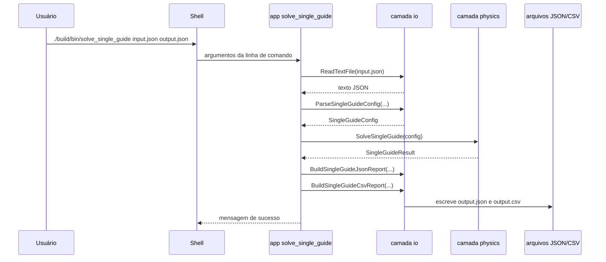
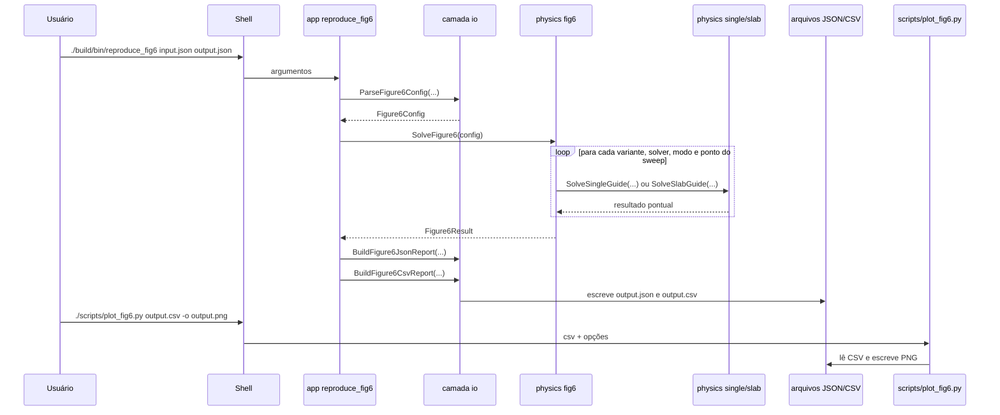
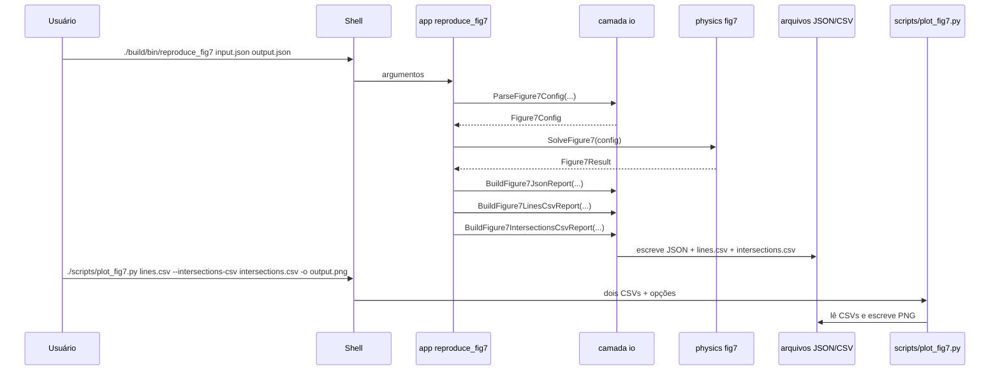
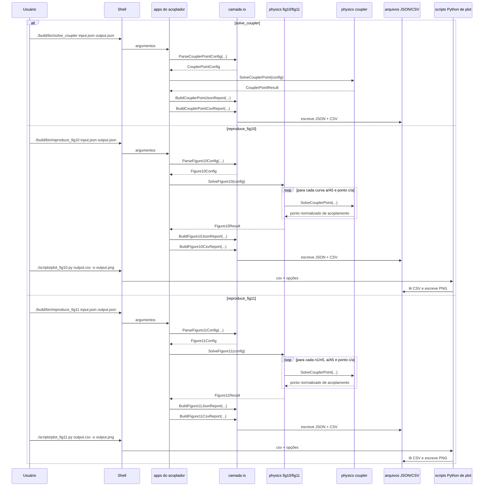

# 14. Diagramas de Fluxo e Sequência

Estes diagramas oferecem uma visão geral da arquitetura do repositório e do fluxo de execução para as principais aplicações. Eles são uma excelente ferramenta para entender como as diferentes partes do código colaboram.

Os arquivos-fonte canônicos `.mmd` preservados em `docs/diagrams/` são:

- `fluxo_geral.mmd`
- `sequence_solve_single_guide.mmd`
- `sequence_reproduce_fig6.mmd`
- `sequence_reproduce_fig7.mmd`
- `sequence_coupler_fig10_fig11.mmd`

## 1. Arquitetura Geral

Arquivo Mermaid equivalente:
[docs/diagrams/fluxo_geral.mmd](diagrams/fluxo_geral.mmd)

Este diagrama mostra como as diferentes partes do projeto se interconectam.

```mermaid
graph TD
    subgraph User
        A[Configuração JSON] --> B{Execução de Script};
    end

    subgraph "Orquestração (scripts/run/)"
        B -- 1. Compila --> C{CMake};
        B -- 2. Executa --> D[Apps C++];
        B -- 4. Executa --> G[Scripts Python];
    end

    subgraph "Código Fonte (src/, include/)"
        D -- Chama --> E[Camada de Física];
        E -- Usa --> F[Camada de Matemática];
    end

    subgraph "Dados (data/)"
        A --> D;
        D -- 3. Escreve --> H[Resultados CSV/JSON];
        H --> G;
    end

    subgraph "Artefatos Finais"
        G -- 5. Gera --> I[Gráficos PNG];
    end

    style User fill:#cde4ff
    style "Orquestração (scripts/run/)" fill:#e1d5e7
    style "Código Fonte (src/, include/)" fill:#d5e8d4
    style "Dados (data/)" fill:#f8cecc
    style "Artefatos Finais" fill:#fff2cc
```

## 2. `solve_single_guide`

Arquivo Mermaid equivalente:
[docs/diagrams/sequence_solve_single_guide.mmd](diagrams/sequence_solve_single_guide.mmd)



## 3. `reproduce_fig6`

Arquivo Mermaid equivalente:
[docs/diagrams/sequence_reproduce_fig6.mmd](diagrams/sequence_reproduce_fig6.mmd)



## 4. `reproduce_fig7`

Arquivo Mermaid equivalente:
[docs/diagrams/sequence_reproduce_fig7.mmd](diagrams/sequence_reproduce_fig7.mmd)



## 5. `solve_coupler`, `reproduce_fig10` e `reproduce_fig11`

Arquivo Mermaid equivalente:
[docs/diagrams/sequence_coupler_fig10_fig11.mmd](diagrams/sequence_coupler_fig10_fig11.mmd)



## Observação final

Os diagramas deixam explícita uma decisão de arquitetura do projeto:

- o C++ produz os artefatos científicos;
- o Python cuida da visualização;
- os scripts `run/*.sh` organizam a execução reproduzível.

Essa separação ajuda muito quando queremos revisar:

- a matemática sem mexer na apresentação;
- a apresentação sem mexer na matemática.


<!-- NAV START -->
---

**Navegação:** [Anterior](13_validacao_e_limites_do_modelo.md) | [Índice](00_resumo.md) | [Checklist](09_checklist_reproducao.md) | [Roteiro](15_roteiro_de_estudo.md) | [Riscos](23_riscos_tecnicos_e_pendencias.md) | [Próximo](15_roteiro_de_estudo.md)

<!-- NAV END -->
