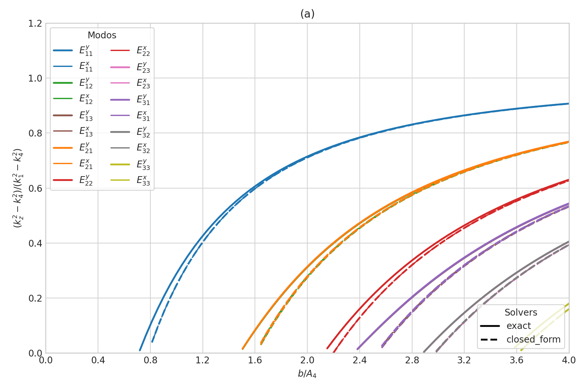
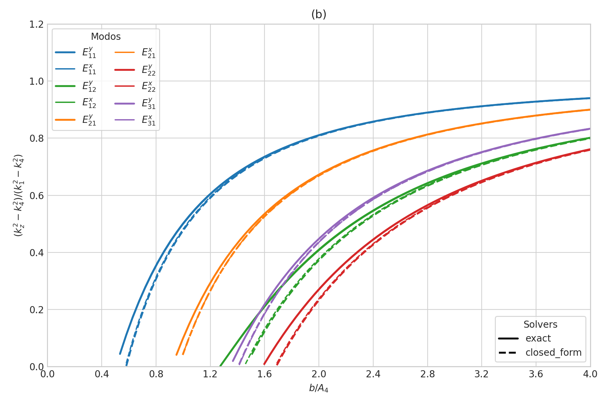
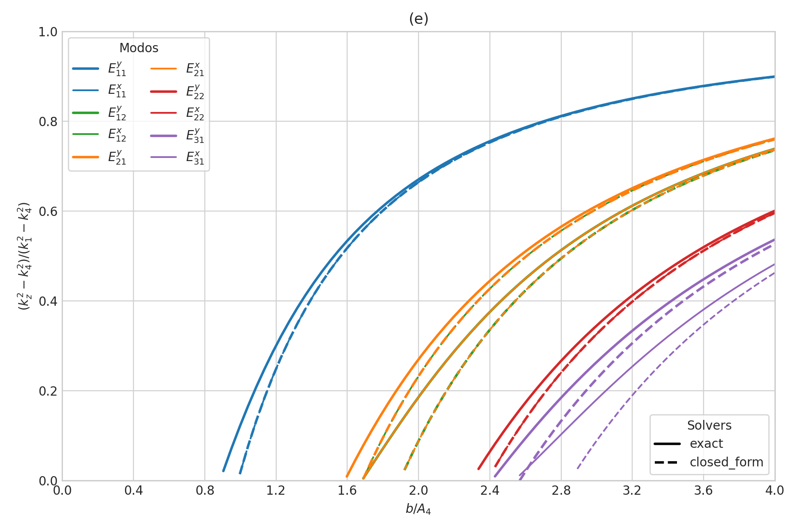
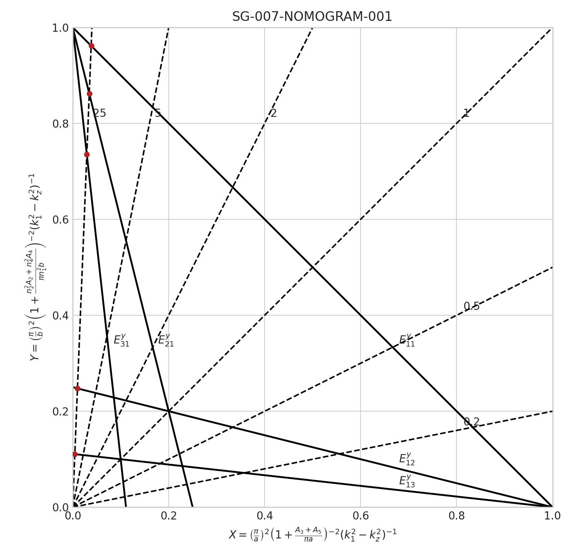
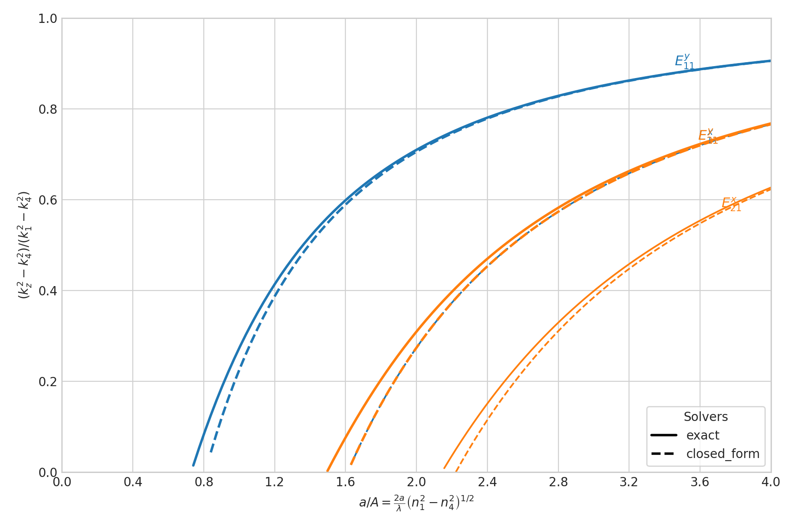
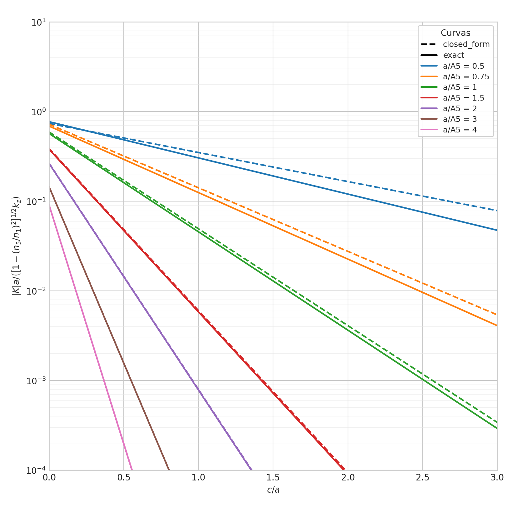
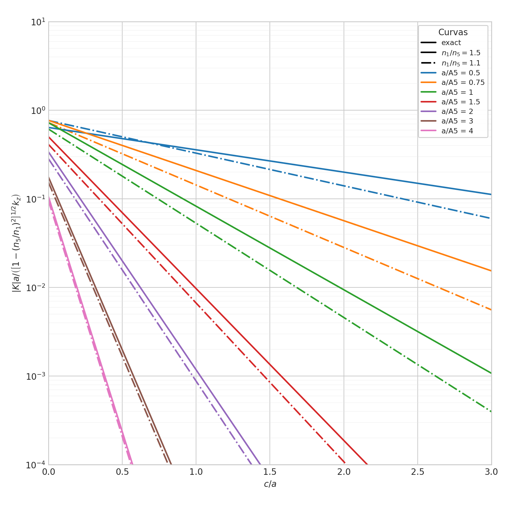
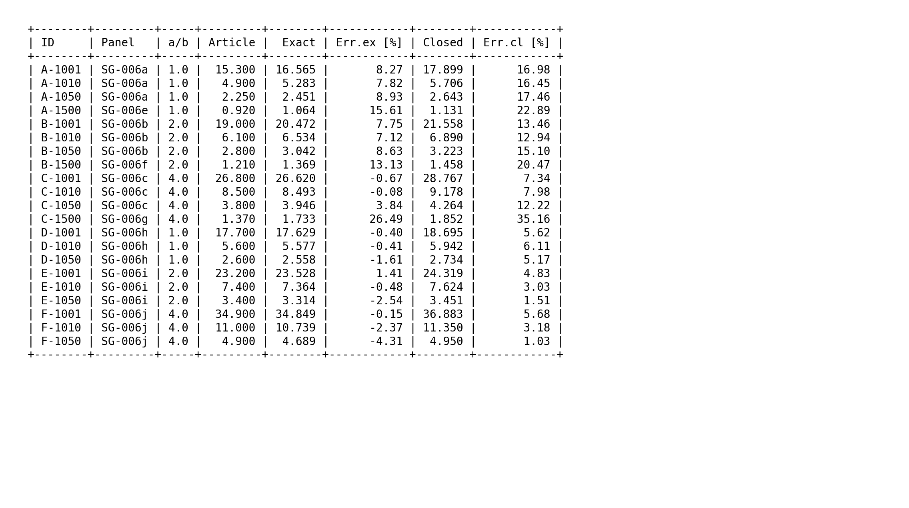

# Resultados Calculados — Marcatili (1969)

Reprodução numérica de figuras e tabelas do artigo:

> E. A. J. Marcatili, "Dielectric rectangular waveguide and directional coupler for integrated optics,"
> *Bell System Technical Journal*, vol. 48, pp. 2071–2102, 1969.

Todos os dados numéricos são gerados pelo núcleo em C++ e salvos em `data/output/` como JSON e CSV.
Os gráficos são renderizados pelos scripts Python em `scripts/`.
Para regenerar tudo: `./scripts/run.sh reproduce`.

---

## Convenções visuais

### Cores por modo

Cada par de índices `(p, q)` tem uma cor fixa em todos os gráficos:

| Modo `(p, q)` | Cor | Hex |
|---|---|---|
| (1, 1) | Azul | `#1f77b4` |
| (2, 1) | Laranja | `#ff7f0e` |
| (1, 2) | Verde | `#2ca02c` |
| (2, 2) | Vermelho | `#d62728` |
| (3, 1) | Roxo | `#9467bd` |
| (1, 3) | Marrom | `#8c564b` |
| (2, 3) | Rosa | `#e377c2` |
| (3, 2) | Cinza | `#7f7f7f` |
| (3, 3) | Amarelo-verde | `#bcbd22` |

### Espessura de linha por família de modo

| Família | Espessura | Significado |
|---|---|---|
| `E_y` | 2.0 px | Campo elétrico dominante em y |
| `E_x` | 1.4 px | Campo elétrico dominante em x |

### Estilo de linha por modelo de solver

| Solver | Estilo |
|---|---|
| `exact` | Sólido `—` |
| `closed_form` | Tracejado `- -` |

---

## Notação de modo

Os modos são identificados como `E_y:p:q` ou `E_x:p:q`, onde:

- **Família**: `E_y` (polarização predominante em y) ou `E_x` (polarização em x)
- **p**: índice transversal na direção x (número inteiro ≥ 1)
- **q**: índice transversal na direção y (número inteiro ≥ 1)

Nos arquivos de saída CSV e JSON, os modos aparecem como `curve_id` no formato `E_y_1_1` (underscores).
Nos arquivos de entrada JSON, o formato de referência é `"E_y:1:1"` (dois-pontos).

---

## Estrutura dos arquivos de entrada (JSON)

Todos os arquivos em `data/input/` seguem o padrão:

```
data/input/
├── fig6/           # Um JSON por painel (SG-006a ... SG-006k)
├── franco.json
├── reproduce_fig7.json
├── reproduce_fig8.json
├── reproduce_fig10.json
├── reproduce_fig11.json
├── reproduce_table1.json
├── solve_coupler.json
└── solve_single_guide.json
```

### Campos comuns a todos os JSONs de entrada

| Campo | Tipo | Descrição |
|---|---|---|
| `case_id` | string | Identificador único do caso (ex: `"SG-006a"`) |
| `article_target` | string | Descrição do que o caso representa no artigo |
| `solver_models` | array | Lista de modelos a executar: `["exact", "closed_form"]` |

### Campos comuns aos JSONs de varredura (Fig. 6, 7, 8)

| Campo | Tipo | Descrição |
|---|---|---|
| `wavelength` | float | Comprimento de onda em metros (ex: `1e-6`) |
| `n1` | float | Índice de refração do núcleo |
| `n2`…`n5` | float | Índices das cinco regiões de revestimento |
| `point_count` | int | Número de pontos na varredura |
| `modes` | array | Lista de modos a calcular no formato `"E_y:p:q"` |

---

## 1. Figura 6 — Curvas de dispersão do guia retangular

**Arquivo de entrada:** `data/input/fig6/SG-006a.json` … `SG-006k.json`

**Saídas por painel:** `data/output/fig6/SG-006*.json`, `.csv`, `.png`

**Executável C++:** `reproduce_fig6`  **Script de plotagem:** `scripts/plot_fig6.py`

Cada painel varre `b/A₄` de 0.35 a 4.0 e calcula a constante de propagação normalizada:

$$\frac{k_z^2 - k_4^2}{k_1^2 - k_4^2}$$

para cada modo solicitado. Os 11 painéis cobrem combinações de razão `a/b` (1, 2 ou 4) e contraste de índice `Δn/n` (0,1%, 1%, 5% ou 100%).

### JSON de entrada — esquema

```json
{
  "case_id": "SG-006a",
  "article_target": "Figura 6a — guia imerso, baixo contraste",
  "panel_id": "SG-006a",
  "solver_models": ["exact", "closed_form"],
  "wavelength": 1e-6,
  "a_over_b": 1.0,
  "n1": 1.5,
  "n2": 1.4851...,
  "n3": 1.4851...,
  "n4": 1.4851...,
  "n5": 1.4851...,
  "b_over_A4_min": 0.35,
  "b_over_A4_max": 4.0,
  "point_count": 80,
  "modes": ["E_y:1:1", "E_x:1:1", "E_y:2:1", ...]
}
```

| Campo | Descrição |
|---|---|
| `a_over_b` | Razão entre as dimensões transversais do guia |
| `n2`, `n3` | Índices dos revestimentos laterais (x) |
| `n4`, `n5` | Índices dos revestimentos superior/inferior (y) |
| `b_over_A4_min/max` | Faixa de varredura do parâmetro normalizado `b/A₄` |
| `panel_id` | Identificador do painel (usado nos arquivos de saída) |

### CSV de saída — colunas principais

| Coluna | Tipo | Descrição |
|---|---|---|
| `case_id` | string | Identificador do caso |
| `panel_id` | string | Identificador do painel |
| `curve_id` | string | Ex: `"E_y_1_1"` |
| `solver_model` | string | `"exact"` ou `"closed_form"` |
| `mode_family` | string | `"E_y"` ou `"E_x"` |
| `p`, `q` | int | Índices transversais do modo |
| `b_over_A4` | float | Parâmetro normalizado da varredura (eixo x) |
| `kz_normalized_against_n4` | float | Propagação normalizada (eixo y, 0–1) |
| `guided` | 0/1 | Se o modo está guiado neste ponto |
| `domain_valid` | 0/1 | Se todos os parâmetros derivados são físicos |
| `kx`, `ky`, `kz` | float | Componentes do vetor de onda (rad/m) |

### Painéis gerados

| Painel | a/b | Δn/n | Arquivo PNG |
|---|---|---|---|
| SG-006a | 1 | 1% | [fig6/SG-006a.png](../data/output/fig6/SG-006a.png) |
| SG-006b | 2 | 1% | [fig6/SG-006b.png](../data/output/fig6/SG-006b.png) |
| SG-006c | 4 | 1% | [fig6/SG-006c.png](../data/output/fig6/SG-006c.png) |
| SG-006d | 1 | 5% | [fig6/SG-006d.png](../data/output/fig6/SG-006d.png) |
| SG-006e | 1 | 100% | [fig6/SG-006e.png](../data/output/fig6/SG-006e.png) |
| SG-006f | 2 | 100% | [fig6/SG-006f.png](../data/output/fig6/SG-006f.png) |
| SG-006g | 4 | 100% | [fig6/SG-006g.png](../data/output/fig6/SG-006g.png) |
| SG-006h | 1 | misto | [fig6/SG-006h.png](../data/output/fig6/SG-006h.png) |
| SG-006i | 2 | misto | [fig6/SG-006i.png](../data/output/fig6/SG-006i.png) |
| SG-006j | 4 | misto | [fig6/SG-006j.png](../data/output/fig6/SG-006j.png) |
| SG-006k | — | variante | [fig6/SG-006k.png](../data/output/fig6/SG-006k.png) |

**Painel SG-006a** (`a/b = 1`, `Δn/n ≈ 1%`):



**Painel SG-006b** (`a/b = 2`, `Δn/n ≈ 1%`):



**Painel SG-006e** (`a/b = 1`, guia no ar, `n₂=n₃=n₄=n₅=1`):



---

## 2. Figura 7 — Nomograma de projeto

**Arquivo de entrada:** `data/input/reproduce_fig7.json`

**Saídas:** `data/output/reproduce_fig7.json`, `.lines.csv`, `.intersections.csv`

**Executável C++:** `reproduce_fig7`  **Script de plotagem:** `scripts/plot_fig7.py`

O nomograma relaciona as dimensões físicas do guia (`a`, `b`) com os parâmetros normalizados `C_x` e `C_y`, permitindo projeto gráfico direto. Cada linha de modo (`E_y:p:q`) e cada linha de `C` constante é uma curva paramétrica no espaço `(C_x, C_y)`.



### JSON de entrada — esquema

```json
{
  "case_id": "SG-007-NOMOGRAM-001",
  "article_target": "Nomograma Fig. 7 com exemplo de projeto",
  "article_reference_mode": "E_y:2:1",
  "article_reference_y_readoff": 0.88,
  "wavelength": 1e-6,
  "a": 25e-6,
  "b": 5e-6,
  "n1": 1.5,
  "n2": 1.425,
  "n3": 1.497,
  "n4": 1.425,
  "n5": 1.497,
  "line_point_count": 240,
  "reference_c_value": 25.0,
  "modes": ["E_y:3:1", "E_y:2:1", "E_y:1:1", "E_y:1:2", "E_y:1:3"],
  "c_values": ["0.2", "0.5", "1", "2", "5", "25"]
}
```

| Campo | Descrição |
|---|---|
| `a`, `b` | Dimensões físicas do exemplo de projeto (metros) |
| `article_reference_mode` | Modo usado como referência de leitura gráfica no artigo |
| `article_reference_y_readoff` | Valor `C_y` lido graficamente no artigo para validação |
| `line_point_count` | Pontos por curva paramétrica |
| `c_values` | Valores de `C` para as linhas iso-C no nomograma |

### CSVs de saída

**`.lines.csv`** — pontos das curvas paramétricas:

| Coluna | Descrição |
|---|---|
| `line_type` | `"mode"` (linha de modo) ou `"c_line"` (linha de C constante) |
| `line_id` | Identificador da curva (ex: `"E_y_2_1"` ou `"C=25"`) |
| `cx` | Coordenada x do nomograma (`2a/λ · √(n₁²−n₃²)`) |
| `cy` | Coordenada y do nomograma (`2b/λ · √(n₁²−n₄²)`) |

**`.intersections.csv`** — pontos de interseção entre linhas de modo e linhas de C:

| Coluna | Descrição |
|---|---|
| `mode_line_id` | Modo da interseção (ex: `"E_y_2_1"`) |
| `c_line_id` | Linha de C da interseção (ex: `"C=25"`) |
| `x`, `y` | Coordenadas no nomograma |
| `guided` | Se o modo está guiado neste ponto |
| `kz_normalized_against_n4` | Propagação normalizada no ponto de interseção |

---

## 3. Figura 8 — Interface superior metálica

**Arquivo de entrada:** `data/input/reproduce_fig8.json`

**Saídas:** `data/output/reproduce_fig8.json`, `.csv`

**Executável C++:** `reproduce_fig8`  **Script de plotagem:** `scripts/plot_fig8.py`

Varre `a/A` de 0.05 a 4.0 com a interface superior tratada como parede PEC (metal perfeito).
As condições de contorno E_y e E_x são modificadas: para E_y a fase superior é fixada em π/2;
para E_x o campo tangencial é forçado a zero na parede metálica.



### JSON de entrada — esquema

```json
{
  "case_id": "SG-008-METAL-001",
  "article_target": "Figura 8 — interface metálica superior",
  "ocr_note": "Nota de leitura OCR do artigo original...",
  "wavelength": 1e-6,
  "a_over_b": 2.0,
  "n1": 1.5,
  "n4": 1.4285714285714286,
  "a_over_A_min": 0.05,
  "a_over_A_max": 4.0,
  "point_count": 121,
  "solver_models": ["exact", "closed_form"],
  "modes": ["E_y:1:1", "E_x:1:1", "E_y:2:1", "E_x:2:1"]
}
```

| Campo | Descrição |
|---|---|
| `n4` | Único índice de revestimento relevante; `n4 = n1/1.05 ≈ 1.4286` |
| `a_over_A_min/max` | Faixa de varredura de `a/A = (2a/λ)·√(n₁²−n₄²)` (eixo x) |
| `ocr_note` | Notas de incerteza na leitura do scan do artigo original |

### CSV de saída — colunas principais

| Coluna | Descrição |
|---|---|
| `a_over_A` | Parâmetro normalizado de largura do guia (eixo x) |
| `kz_normalized_against_n4` | Propagação normalizada (eixo y, 0–1) |
| `curve_id` | Ex: `"E_y_1_1"` |
| `solver_model` | `"exact"` ou `"closed_form"` |
| `mode_family`, `p`, `q` | Identificação do modo |

---

## 4. Figura 10 — Acoplador direcional (família E_x)

**Arquivo de entrada:** `data/input/reproduce_fig10.json`

**Saídas:** `data/output/reproduce_fig10.json`, `.csv`

**Executável C++:** `reproduce_fig10`  **Script de plotagem:** `scripts/plot_fig10.py`

Curvas de acoplamento normalizado `|K|` em função da separação `c/a` entre os guias,
para diferentes valores de `a/A₅ = (2a/λ)·√(n₁²−n₅²)`.
Usa a equação transcendente (6) para a raiz transversal no modo E_x (limite simétrico `n₃=n₅`).



### JSON de entrada — esquema

```json
{
  "case_id": "CP-010-FIG10-001",
  "article_target": "Figura 10 — curvas de acoplamento E_x",
  "ocr_note": "Nota de leitura OCR...",
  "c_over_a_min": 0.0,
  "c_over_a_max": 3.0,
  "point_count": 151,
  "solver_models": ["exact", "closed_form"],
  "curves": [
    {"a_over_A5": 0.5,  "curve_id": "a_over_A5=0.5",  "label": "0.5"},
    {"a_over_A5": 0.75, "curve_id": "a_over_A5=0.75", "label": "0.75"},
    {"a_over_A5": 1.0,  "curve_id": "a_over_A5=1",    "label": "1"},
    {"a_over_A5": 1.5,  "curve_id": "a_over_A5=1.5",  "label": "1.5"},
    {"a_over_A5": 2.0,  "curve_id": "a_over_A5=2",    "label": "2"},
    {"a_over_A5": 3.0,  "curve_id": "a_over_A5=3",    "label": "3"},
    {"a_over_A5": 4.0,  "curve_id": "a_over_A5=4",    "label": "4"}
  ]
}
```

| Campo | Descrição |
|---|---|
| `c_over_a_min/max` | Faixa de varredura da separação normalizada `c/a` (eixo x) |
| `curves[].a_over_A5` | Parâmetro de largura do guia para cada curva |
| `curves[].label` | Rótulo exibido na legenda do gráfico |

### CSV de saída — colunas principais

| Coluna | Descrição |
|---|---|
| `curve_id` | Identificador da curva (ex: `"a_over_A5=0.5"`) |
| `curve_label` | Rótulo legível (ex: `"0.5"`) |
| `solver_model` | `"exact"` ou `"closed_form"` |
| `a_over_A5` | Parâmetro de largura do guia (float) |
| `c_over_a` | Separação normalizada (eixo x) |
| `normalized_coupling` | Acoplamento normalizado `|K|·a/(...)` (eixo y, escala log) |
| `kx_A5_over_pi` | Raiz transversal normalizada |
| `domain_valid` | 0/1 — se a solução é fisicamente válida |

---

## 5. Figura 11 — Acoplador direcional (família E_y)

**Arquivo de entrada:** `data/input/reproduce_fig11.json`

**Saídas:** `data/output/reproduce_fig11.json`, `.csv`

**Executável C++:** `reproduce_fig11`  **Script de plotagem:** `scripts/plot_fig11.py`

Análogo à Fig. 10, mas para o modo E_y com a equação transcendente exata (20).
Inclui duas famílias de razão de índice `n₁/n₅`: 1.5 (sólido) e 1.1 (traço-ponto).



### JSON de entrada — esquema

```json
{
  "case_id": "CP-011-FIG11-001",
  "article_target": "Figura 11 — curvas de acoplamento E_y",
  "ocr_note": "...",
  "c_over_a_min": 0.0,
  "c_over_a_max": 3.0,
  "point_count": 151,
  "solver_models": ["exact"],
  "index_ratios": [
    {"n1_over_n5": 1.5, "ratio_id": "n1_over_n5=1.5", "label": "1.5"},
    {"n1_over_n5": 1.1, "ratio_id": "n1_over_n5=1.1", "label": "1.1"}
  ],
  "curves": [
    {"a_over_A5": 0.5, "curve_id": "a_over_A5=0.5", "label": "0.5"},
    ...
  ]
}
```

| Campo | Descrição |
|---|---|
| `index_ratios` | Famílias de `n₁/n₅`; cada uma gera um conjunto de curvas separadas por estilo de linha |
| `index_ratios[].ratio_id` | Identificador único para a família de índice |

### CSV de saída — colunas adicionais (além das da Fig. 10)

| Coluna | Descrição |
|---|---|
| `ratio_id` | Identificador da família de índice (ex: `"n1_over_n5=1.5"`) |
| `ratio_label` | Rótulo legível (ex: `"1.5"`) |
| `n1_over_n5` | Razão de índice (float) |
| `index_ratio_squared` | `(n₁/n₅)²` — usado diretamente nas equações |

---

## 6. Tabela I — Dimensões de modo único

**Arquivo de entrada:** `data/input/reproduce_table1.json`

**Saídas:** `data/output/reproduce_table1.json`, `.summary.csv`, `.details.csv`, `.md`, `.png`

**Executável C++:** `reproduce_table1`  **Script de plotagem:** `scripts/plot_table1.py`

Calcula as dimensões de corte para operação em modo único, buscando numericamente o ponto
`b/A₄` em que o segundo modo deixa de estar guiado. O resultado é expresso como `a·n₁/λ`.



### JSON de entrada — esquema

```json
{
  "case_id": "SG-TBL-001",
  "article_target": "Tabela I — dimensões de modo único",
  "table_entry_interpretation": "a_times_n1_over_lambda",
  "wavelength": 1e-6,
  "n1": 1.5,
  "solver_models": ["exact", "closed_form"],
  "search_max_p": 4,
  "search_max_q": 4,
  "search_b_normalized_min": 0.01,
  "search_b_normalized_max": 50.0,
  "search_cutoff_tolerance": 1e-6,
  "rows": [
    {
      "row_id": "SG-TBL-001A-1001",
      "article_panel_id": "SG-006a",
      "a_over_b": 1.0,
      "n2": 1.4985...,
      "n3": 1.4985...,
      "n4": 1.4985...,
      "n5": 1.4985...,
      "article_dimension_normalized": 15.30
    },
    ...
  ]
}
```

| Campo | Descrição |
|---|---|
| `table_entry_interpretation` | Interpretação da grandeza tabelada (`a·n₁/λ`) |
| `search_max_p/q` | Índices máximos varridos na busca de corte |
| `search_b_normalized_min/max` | Faixa de busca para `b/A₄` |
| `search_cutoff_tolerance` | Tolerância numérica da bissecção |
| `rows[].article_dimension_normalized` | Valor lido no artigo original (para comparação) |
| `rows[].article_panel_id` | Painel da Fig. 6 ao qual a linha corresponde |

### CSVs de saída

**`.summary.csv`** — uma linha por configuração material:

| Coluna | Descrição |
|---|---|
| `row_id` | Identificador da linha |
| `article_panel_id` | Painel de referência |
| `a_over_b` | Razão de aspecto |
| `exact_cutoff` | Dimensão de corte calculada (exact) |
| `closed_form_cutoff` | Dimensão de corte calculada (closed_form) |
| `article_value` | Valor do artigo |
| `exact_rel_error` | Erro relativo do solver exact |

**`.details.csv`** — pontos da varredura de bissecção (para diagnóstico).

---

## 7. Solução pontual — Guia simples

**Arquivo de entrada:** `data/input/solve_single_guide.json`

**Saídas:** `data/output/solve_single_guide.json`, `.csv`

**Executável C++:** `solve_single_guide`

Calcula todas as grandezas derivadas para um único ponto de operação do guia retangular:
modo, comprimento de onda, geometria e materiais dados explicitamente.

### JSON de entrada — esquema

```json
{
  "case_id": "SG-POINT-001",
  "article_target": "Ponto de operação exemplo",
  "solver_model": "closed_form",
  "mode_family": "E_y",
  "mode_indices": {"p": 1, "q": 1},
  "geometry": {
    "wavelength": 1e-6,
    "a": 3.54e-6,
    "b": 1.77e-6
  },
  "materials": {
    "n1": 1.5,
    "n2": 1.4851...,
    "n3": 1.4851...,
    "n4": 1.4851...,
    "n5": 1.4851...
  },
  "boundary_conditions": {
    "guide_limit": "c_infinity",
    "approximation_regime": "well_guided_closed_form"
  }
}
```

| Campo | Descrição |
|---|---|
| `solver_model` | Modelo a usar (`"exact"` ou `"closed_form"`) |
| `mode_family` | Família do modo (`"E_y"` ou `"E_x"`) |
| `mode_indices.p`, `.q` | Índices transversais do modo |
| `geometry.a`, `.b` | Dimensões físicas do guia em metros |
| `boundary_conditions.guide_limit` | `"c_infinity"` (guia isolado) |

### JSON de saída — campos principais

| Campo | Descrição |
|---|---|
| `status` | `"ok"` ou código de erro |
| `guided` | `true` se o modo está guiado |
| `domain_valid` | `true` se todas as grandezas são físicas |
| `equations_used` | Referência às equações do artigo usadas |
| `derived.kx`, `.ky`, `.kz` | Componentes do vetor de onda (rad/m) |
| `derived.b_over_A4` | Parâmetro normalizado |
| `derived.kz_normalized_against_n4` | Propagação normalizada (0–1) |
| `approximation_checks` | Verificação da validade dos aproximações closed-form |

---

## 8. Solução pontual — Acoplador direcional

**Arquivo de entrada:** `data/input/solve_coupler.json`

**Saídas:** `data/output/solve_coupler.json`, `.csv`

**Executável C++:** `solve_coupler`

Calcula o acoplamento normalizado e o comprimento de transferência completo para um
único ponto de operação do acoplador direcional.

### JSON de entrada — esquema

```json
{
  "case_id": "CP-POINT-010-BASE",
  "article_target": "Ponto base do acoplador, Eq. (34)",
  "solver_model": "exact",
  "transverse_equation": "eq6",
  "mode_indices": {"p": 1},
  "normalized_geometry": {
    "a_over_A5": 1.6,
    "c_over_a": 2.5
  },
  "geometry": {"wavelength": 1e-6},
  "materials": {
    "n1": 1.8,
    "n5": 1.5,
    "n1_over_n5": 1.5
  }
}
```

| Campo | Descrição |
|---|---|
| `transverse_equation` | Equação para a raiz transversal: `"eq6"` (E_x) ou `"eq20"` (E_y) |
| `normalized_geometry.a_over_A5` | Largura normalizada do guia |
| `normalized_geometry.c_over_a` | Separação normalizada entre guias |
| `materials.n1_over_n5` | Razão de índice (deve ser consistente com `n1` e `n5`) |

### JSON de saída — campos principais

| Campo | Descrição |
|---|---|
| `transverse_root_found` | `true` se a bissecção convergiu |
| `normalized_outputs.kx_A5_over_pi` | Raiz transversal normalizada |
| `normalized_outputs.normalized_coupling` | Acoplamento normalizado |
| `dimensional_outputs.full_transfer_length` | Comprimento de transferência completo (metros) |
| `dimensional_outputs.coupling_magnitude` | Magnitude do coeficiente de acoplamento (m⁻¹) |

---

## Reprodução completa

Para regenerar todos os dados numéricos e gráficos:

```bash
./scripts/run.sh reproduce
```

Para regenerar apenas uma figura específica:

```bash
./scripts/run.sh fig6    # painéis a–k da Fig. 6
./scripts/run.sh fig7    # nomograma Fig. 7
./scripts/run.sh fig8    # Fig. 8 interface metálica
./scripts/run.sh fig10   # Fig. 10 acoplador E_x
./scripts/run.sh fig11   # Fig. 11 acoplador E_y
./scripts/run.sh table1  # Tabela I
```

Para verificar a presença e integridade dos artefatos:

```bash
./scripts/run.sh check
```
